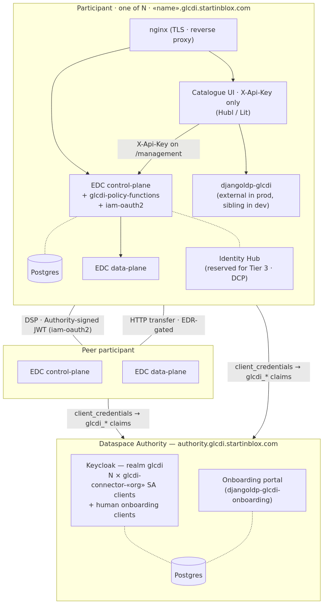
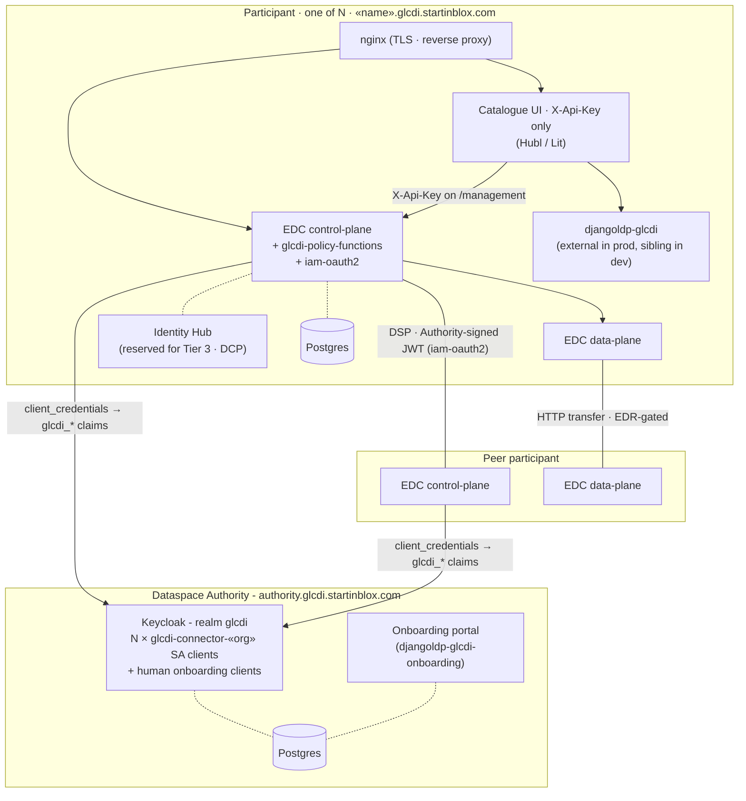

# GLCDI Dataspace Architecture

Technical architecture of the **Grazing Lands Carbon Data Initiative (GLCDI)** dataspace - the federated, decentralised infrastructure that lets participants share soil-organic-carbon and grazing-management data under enforceable consent, and the interoperability standards that make that sharing portable across implementations.

This document is the entry point for the "Data Space Architecture Design" deliverable. It describes the topology, the components each participant runs, how data flows between them under the Dataspace Protocol (DSP), and where the technical enforcement boundary lies. For per-mechanism specification traceability see [`STANDARDS.md`](STANDARDS.md); for the identity model in detail see [`IDENTITY.md`](IDENTITY.md); for the phased implementation plan see [`IMPLEM_PLAN.md`](IMPLEM_PLAN.md).

---

## 1. Design principles

GLCDI's architecture is shaped by four commitments:

- **Federated, not central.** Data stays on the participant side. The Authority publishes and runs the governance services (identity, roles, policies) and hosts onboarding; it does not proxy, store, or observe payloads or data transfers.
- **Consent-governed and permissioned.** Every asset carries a policy; every access is negotiated; every transfer is EDR-gated. The default is "not discoverable."
- **Standards-first.** Every mechanism used by the dataspace is backed by a public specification (Dataspace Protocol, ODRL, DCAT, OIDC, OAuth 2.0, JSON-LD, and - at Tier 3 - DCP / IATP / W3C VCs). Nothing proprietary sits on the critical path.
- **Tiered identity, tiered ambition.** The M1 prototype ships on the smallest identity model that makes the policy stack work (Tier 1). Richer credential surfaces (Tier 2 user OIDC, Tier 3 Verifiable Credentials) layer on top without rewriting the connector trust chain.

---

## 2. System context

GLCDI is a **one Authority + N participants** system:

- **The Dataspace Authority** - one instance (`authority.glcdi.startinblox.com`) hosting a Keycloak realm (the source of truth for participant identity, roles, and claims) plus the onboarding portal. See [`AUTHORITY.md`](AUTHORITY.md) for the proposed governance body behind the deployment.
- **N participants** - each participant deploys the same self-contained Compose stack, gets its own subdomain (`«name».glcdi.startinblox.com`), and controls its own datasets. Participants join by application, are approved by the Authority, and are provisioned as a Keycloak realm entry (a service-account client at Tier 1; a client + human user at Tier 2).
- **Peer-to-peer data plane.** Once negotiated, data flows directly between participant connectors over the Dataspace Protocol (DSP). The Authority is not on the data path.
- **External billing / payment infrastructure** (Tier 2+, post-M1). GLCDI does not run its own payment rail; the payment-gating design ([`PAYMENT_GATING.md`](PAYMENT_GATING.md)) integrates with the participant's own billing system and records payment status on the immutable DSP agreement.

---

## 3. Reference topology (Tier 1 - M1 target)

The diagram below shows the M1 topology: one Authority Keycloak, one participant presented fully, and one peer participant collapsed. The `X-Api-Key` at the UI edge and the Authority-signed JWT on the DSP edge are the *only* auth mechanisms at this stage - no OAuth2, no per-participant Keycloak, no per-user OIDC redirect.

Mermaid source (regenerate with <code>architecture.mmd</code> + <code>minlag/mermaid-cli</code>)

---

## 4. Components

Each block in the diagram maps to a repo in the GLCDI workspace and a well-scoped runtime role.

| Block | Repo | Runtime role |
|-------|------|--------------|
| Authority Keycloak | `authority-services/` | Realm `glcdi` - realm roles, claim mappers, one `glcdi-connector-«org»` service-account client per participant connector, plus the human onboarding clients (Tier 2 carryover). |
| Onboarding portal | `authority-services/` | Public registration form + Django admin approval workflow; provisions the KC group, user, and roles on approval (`djangoldp-glcdi-onboarding`). |
| EDC control-plane + extensions | `edc-connector/` + `edc-glcdi-extension/` | DSP endpoints, policy evaluation, contract negotiation, transfer coordination. `edc-glcdi-extension/` source is copy-merged into `edc-connector/extensions/` at CI build time. |
| EDC data-plane | `edc-connector/` | HTTP data-plane, EDR-gated dataset delivery. Bundled with the control-plane in the M1 image; scalable as a separate runtime post-M1 if needed. |
| Identity Hub | `participant-agent-services/` | VC / DCP subsystem - deployed but off the M1 critical path; reserved for Tier 3. |
| Catalogue UI | `participant-ui/` (upstream Hubl clone in `orbit/`) | Single runtime-configurable image; per-participant title, colours, and package endpoints substituted at container start. |
| djangoldp-glcdi | External per-participant deployment in staging/prod; sibling container in dev | LDP resource server used by the UI (farms, plots, metrics, cattle rotations). Permissions gated by `EdcContractPermissionV3`. |
| nginx | `participant-agent-services/` | TLS termination + reverse proxy. No oauth2-proxy at Tier 1. |

---

## 5. Data flow - Tier 1 walkthrough

A single scenario illustrates every edge in the diagram. **Provider** publishes a regenerative-grazing SOC dataset; a **verified regenerative producer** consumer discovers it and pulls the bytes; a **researcher** consumer is filtered out by the access policy.

1. **Boot-time trust setup.** On start, each participant connector runs a `client_credentials` grant against the Authority Keycloak using its `glcdi-connector-«org»` service-account credentials. The returned JWT carries the participant's claims: `glcdi_membership`, `glcdi_roles`, `glcdi_certification_status`, `glcdi_contribution_status`, `glcdi_organisation`. The connector caches this token and refreshes it on expiry.
2. **Provider seeds an asset.** An operator on the provider participant calls its own connector's `/management` API with the operator `X-Api-Key`. The seed writes an asset (with an HttpData source pointing at the participant's LDP resource), an access policy (`glcdi:certificationStatus eq "regenerative-verified"`), a contract policy (`odrl:purpose eq glcdi:InternalAnalysis`), and a contract definition binding them.
3. **Consumer queries the catalog.** The consumer's operator opens the Catalogue UI, which calls the consumer connector's `/management/v3/catalog/request` (with the operator `X-Api-Key`) to fetch the provider's catalog. The consumer connector sends a DSP `CatalogRequest` to the provider, attaching its cached Authority JWT as `Authorization: Bearer …`.
4. **Provider filters the catalog.** The provider's EDC (running `iam-oauth2`) verifies the JWT signature against the Authority JWKS and surfaces the `glcdi_*` claims to the policy engine. The access policy is evaluated: the verified regenerative producer's `glcdi_certification_status=regenerative-verified` passes; the researcher's does not. The provider returns a filtered catalog.
5. **Consumer negotiates.** The consumer proposes a contract offer; the provider re-evaluates the contract policy at negotiation time (purpose check), reaches `FINALIZED` (or `TERMINATED` on mismatch).
6. **Transfer.** The consumer requests a transfer; the provider issues an EDR token pointing at its data-plane. The consumer calls the data-plane endpoint with the EDR (browser-side over CORS with echoed `Access-Control-Allow-Origin` + `Allow-Credentials`), the data-plane resolves the underlying HttpData source through the LDP, and the bytes flow directly between the two participants. **The Authority is not on this path.**

The [Bruno collection](bruno/) exercises every step of this walkthrough; see [`ops/deployment.md` § 3](ops/deployment.md) for the local end-to-end run.

---

## 6. Interoperability standards

Every mechanism above rests on a public specification. The condensed mapping:

| Layer | Standard | Where used |
|-------|----------|------------|
| Contract negotiation, transfer, catalog | [Dataspace Protocol (DSP)](https://docs.internationaldataspaces.org/ids-knowledgebase/dataspace-protocol/) | Every connector-to-connector call |
| Policy expression | [ODRL 2.2](https://www.w3.org/TR/odrl-model/) | All policy JSON in `policies/` |
| Catalog metadata | [DCAT 3](https://www.w3.org/TR/vocab-dcat-3/) | Catalog responses |
| Serialisation | [JSON-LD 1.1](https://www.w3.org/TR/json-ld11/) + `context.jsonld` | Every policy and catalog document |
| Connector identity (Tier 1–2) | [OpenID Connect Core](https://openid.net/specs/openid-connect-core-1_0.html), [OAuth 2.0 Client Credentials](https://datatracker.ietf.org/doc/html/rfc6749#section-4.4), [JWT (RFC 7519)](https://datatracker.ietf.org/doc/html/rfc7519) | Authority KC → connector token; connector-to-connector DSP auth |
| Connector identity (Tier 3, deferred) | [Decentralized Claims Protocol (DCP)](https://projects.eclipse.org/projects/technology.dataspace-decentralized-claims-protocol), [IATP](https://github.com/eclipse-tractusx/identity-trust), [W3C Verifiable Credentials 2.0](https://www.w3.org/TR/vc-data-model-2.0/), [W3C DIDs 1.0](https://www.w3.org/TR/did-core/) | Identity Hub; reserved for the connector-VC migration |
| LDP resource semantics | [W3C Linked Data Platform 1.0](https://www.w3.org/TR/ldp/) | Participant `djangoldp-glcdi` backend |

Full per-mechanism traceability (which mechanism, which sub-spec clause, which file) lives in [`STANDARDS.md`](STANDARDS.md).

---

## 7. Identity tiering

Identity is layered so the M1 prototype ships on the minimum credible model and richer credential surfaces are added as governance / audit needs justify them. All tiers share the same Authority Keycloak realm and the same `glcdi_*` claim shape.

| Tier | Status | UI auth | Connector-to-connector auth | Identity issuer |
|------|--------|---------|-----------------------------|-----------------|
| **Tier 1** (M1 default) | Done | `X-Api-Key` only | Authority-signed JWT (`client_credentials`, `iam-oauth2`) | Authority Keycloak |
| **Tier 2** ([Phase 7.2](IMPLEM_PLAN.md#phase-72-identity-tier-2--add-user-oidc-at-the-ui)) | Deferred post-M1 | `X-Api-Key` + user OIDC Bearer (oauth2-proxy in front of `/management`) | Unchanged from Tier 1 | Authority Keycloak (adds `glcdi-ui` client + groups + human users) |
| **Tier 3** ([Phase 7.3](IMPLEM_PLAN.md#phase-73-identity-tier-3--migrate-connector-identity-to-verifiable-credentials-via-dcp)) | Deferred; long-term direction | Likely `X-Api-Key` + DID-bound presentation | Verifiable Presentation minted by the Identity Hub via DCP / IATP | Per-participant issuer (Authority KC's role as connector-token issuer disappears) |

See [`IDENTITY.md`](IDENTITY.md) for the tier rationale, the claim model, and the OIDC-vs-OID4VC-vs-VC decision.

---

## 8. Policy enforcement

Not everything a policy asserts can be enforced by code. GLCDI is explicit about where the connector stops and the Data Sharing Agreement (DSA) takes over.

| Mechanism | Enforced by | Examples |
|-----------|-------------|----------|
| Access-policy filtering | EDC connector (automatic) | Hiding offers from non-researchers, non-members |
| Contract-constraint evaluation | EDC connector (at negotiation) | Purpose check, temporal check |
| Payment status + transfer gating | Connector extension (v0 request filter on transfer initiation; v1 ODRL constraint function) + external billing/payment + v2 scheduled DSP termination of overdue agreements | `payment-required` policy - see [`PAYMENT_GATING.md`](PAYMENT_GATING.md) |
| Refund obligation (record vs. execute) | Recording: connector (immutable DSP agreement + audit endpoints). Adjudication: Dataspace Authority. Execution: external billing/payment | [`PAYMENT_GATING.md` § 3.3](PAYMENT_GATING.md) |
| Anonymisation | Data Sharing Agreement (legal) | Anonymisation duty |
| Attribution | Data Sharing Agreement (legal) | Citation duty |
| Data deletion | Data Sharing Agreement (legal) | Retention-limit obligation |
| Non-redistribution | Data Sharing Agreement (legal) | Internal-use-only prohibition |

The Trust Framework bridges the gap: it documents governance-level obligations, how compliance is verified (self-attestation, audit, review), and what happens on breach.

---

## 9. Deployment topology

GLCDI runs one Authority deployment and one deployment per participant, all on separate subdomains of `glcdi.startinblox.com`. TLS terminates at each participant's nginx; certificates are issued and renewed via Certbot.

| Host | Deploys | Owner |
|------|---------|-------|
| `authority.glcdi.startinblox.com` | Authority Keycloak, onboarding portal, Postgres | Project team (transitional) → Dataspace Authority (post-ratification) |
| `«name».glcdi.startinblox.com` | Participant stack (nginx, EDC control-plane + data-plane, catalogue UI, Identity Hub, Postgres); djangoldp-glcdi runs externally | Each participant operator |

For the operator's per-VM layout, secret management convention, and CI deploy shape see [`ops/deployment.md`](ops/deployment.md); for the in-flight rename from `governance-*` to `authority-*` see [`ops/authority-migration.md`](ops/authority-migration.md).

---

## 10. Where to go next

| For | Read |
|-----|------|
| The Dataspace Authority's proposed responsibilities, composition, and remit | [`AUTHORITY.md`](AUTHORITY.md) |
| Identity model, realm roles, claim mappers, OIDC-vs-OID4VC-vs-VC rationale | [`IDENTITY.md`](IDENTITY.md) |
| Per-tier authentication design and phased rollout | [`AUTHENTICATION.md`](AUTHENTICATION.md) |
| Policy catalogue, access vs. contract vs. combined scenarios | [`policies/README.md`](policies/README.md) |
| Full standards traceability (ODRL, DSP, DCAT, JSON-LD, identity) | [`STANDARDS.md`](STANDARDS.md) |
| Payment-gating design proposal | [`PAYMENT_GATING.md`](PAYMENT_GATING.md) |
| Phased implementation plan and current status | [`IMPLEM_PLAN.md`](IMPLEM_PLAN.md) |
| Deployment runbook + local end-to-end validation | [`ops/deployment.md`](ops/deployment.md) |
| Governance model overview (Trust Framework, cohorts, membership) | [`README.md`](README.md) |
