# GLCDI Authentication Roadmap

How users, connectors, and the dataspace governance layer authenticate in
GLCDI - today, and where we expect it to go.

This document complements two existing references:
- [`IDENTITY.md`](IDENTITY.md) - the identity tiering rationale and the standards mapping
  (which specs we lean on, why OIDC before OID4VC).
- [`IMPLEM_PLAN.md`](IMPLEM_PLAN.md) - the per-phase implementation backlog (realm JSON,
  protocol mappers, EDC policy functions, onboarding wiring).

The four phases below are the operational shape of authentication at each
milestone. Each phase is **additive on top of the previous one** - none of
them rewrites the connector trust chain or the GLCDI claim shape.

> **Companion presentation:** [`AUTHENTICATION.html`](AUTHENTICATION.html) is a
> reveal.js slide deck of the same material with rendered PlantUML diagrams.
> The diagrams below are the same source the slides embed; both are
> regenerated from [`scripts/plantuml-encode.py`](scripts/plantuml-encode.py).

## Roadmap at a glance

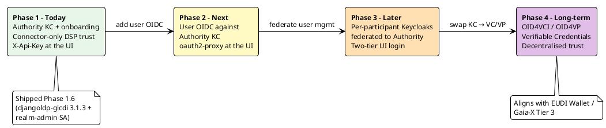

| Phase | What it adds | What it leaves alone | Status |
|------|--------------|---------------------|--------|
| **1 - Authority KC + onboarding** | One central Authority Keycloak (realm `glcdi`); per-org service-account clients for connectors; `djangoldp-glcdi` onboarding form + admin dashboard; realm-admin service account for user provisioning. | Per-participant Catalog UIs are still gated by `X-Api-Key`; no end-user OIDC anywhere. | **Shipped (Phase 1.6).** |
| **2 - User identity on the governance VM** | A `glcdi-ui` OIDC client on the Authority KC; per-org groups; human users; `oauth2-proxy` in front of `/management/`. Users log into Catalog UI via Authority KC. | Connector-to-connector trust chain unchanged. `X-Api-Key` stays as a defence-in-depth floor at the edge. | Proposed. |
| **3 - Local Keycloaks, federated** | Each participant runs its own Keycloak (e.g. realm `caney-fork`). The Authority KC OIDC-brokers to each. UIs do the two-tier flow (governance + silent participant). | All policy machinery, all claim shapes, all DSP-level trust. | Proposed. |
| **4 - OID4VCI / OID4VP** | An OID4VC issuer alongside (or instead of) the Authority KC. User wallets hold VCs; UIs and connectors verify VPs. Trust is anchored in an issuer-DID trust list. | The `glcdi_*` claim names and the EDC policy functions (`GlcdiClaims.java`, etc.) - they extract claims from `ParticipantAgent` whether the issuer was a KC JWT or a VC. | Long-term direction. |

---

## Phase 1 - Authority KC + onboarding (today)

Authority Keycloak is the only identity provider in the dataspace at this
phase. It holds:

- **Connector service-account clients** - one `glcdi-connector-<org>` client per
  participant. The connector authenticates with `client_credentials`; the SA
  user on that client carries `glcdi_*` claims that flow into the JWT via the
  `glcdi-claims` scope mappers.
- **The `governance` client**, used by the onboarding backend to call the KC
  Admin API. This client's service account holds the realm-management
  `realm-admin` role, which is what authorises user / group provisioning when
  an admin approves a registration.
- **Realm roles** - `glcdi_member` plus participant-type roles
  (`glcdi_producer`, `glcdi_researcher`, `glcdi_non_profit`,
  `glcdi_non_regulatory`, etc.) - and the `glcdi_organization` user attribute.
- **Onboarding state**, indirectly: `djangoldp-glcdi` persists registration
  requests in Postgres on the same VM, and on admin approval calls the Admin
  API to materialise the user.

There is no end-user OIDC at the participant Catalog UIs. The UI is gated by
`X-Api-Key` only - operators paste an API key on first load, and the UI uses
that key on `/management/` calls to the local EDC connector.

### Architecture

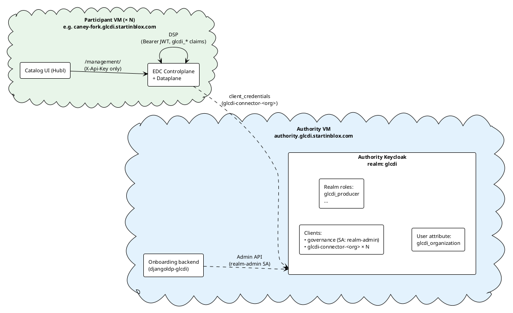

### Sequence - onboarding flow

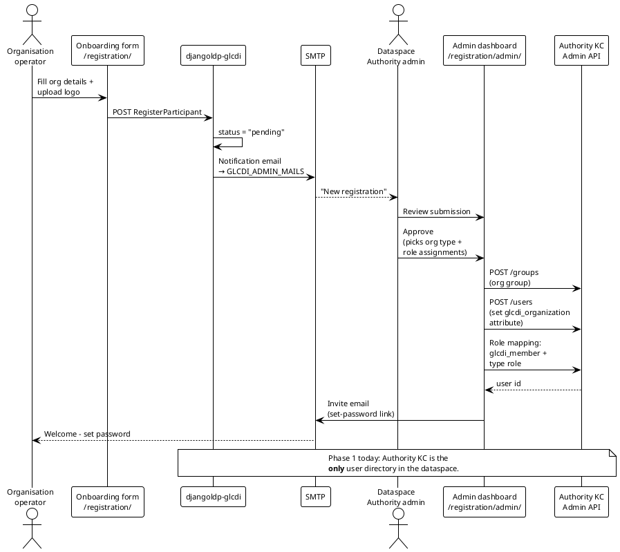

Key implementation references for this flow:
- `governance-services/onboarding/` - Django app + Dockerfile.
- `governance-services/resources/keycloak/realms/glcdi-realm.json` - the
  `governance` client + realm-admin SA + realm roles + `glcdi_organization`
  attribute.
- `governance-services/.gitlab-ci.yml § deploy-authority` - the CI job that
  resolves the latest `djangoldp-glcdi` from PyPI and rebuilds the onboarding
  image on each deploy.

### Sequence - connector-to-connector trust

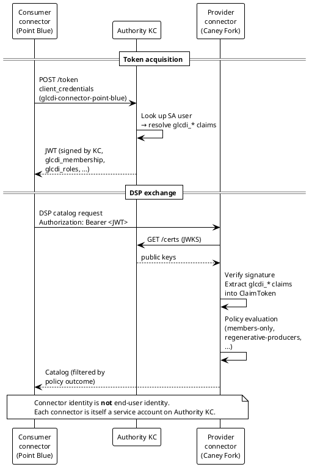

This is the `glcdi-iam-keycloak` extension in action (the hand-rolled OAuth2
`IdentityService` that replaces EDC's removed `iam-oauth2`). The policy
functions (`GlcdiClaims.java` etc. under
`edc-glcdi-extension/extensions/glcdi-policy-functions/`) extract
`glcdi_organization`, `glcdi_roles`, `glcdi_membership` and decide whether
the policy passes.

---

## Phase 2 - User identity management from the governance VM

The first concrete user-facing addition: **end users log into Catalog UIs via
the Authority Keycloak.** Participants do not run their own Keycloak for
users at this phase - there is exactly one user directory in the dataspace,
and it lives on the governance VM.

This is the natural step after Phase 1.6: the onboarding backend already
provisions users into Authority KC. Phase 2 simply lets those users actually
*use* the Catalog UI with their own identity, instead of operators sharing
an API key.

### What changes

- A new OIDC client `glcdi-ui` on the Authority KC (PKCE, public client).
- Per-org groups in Authority KC (`caney-fork-team`, etc.) inherit the
  org-level claims (`glcdi_organization`, `glcdi_member` + type role).
- `oauth2-proxy` in front of `/management/` on each participant VM, configured
  against the Authority KC's JWKS.
- The Catalog UI becomes a real OIDC client (redirect URI per participant).
- `X-Api-Key` stays in place - at this phase both the user JWT *and* the
  API key gate `/management/`. Defence in depth at the participant edge.

### What does not change

- The connector-to-connector trust chain (Phase 1's `client_credentials` +
  DSP) is untouched. Connectors still authenticate as themselves.
- The `glcdi_*` claim shape is unchanged. User JWTs carry the same claims
  the connector JWTs already carry; the EDC policy functions don't care
  whether the JWT came from a user login or a service account.

### Side-channel - LDP-backed datasets

Phase 2 is *orthogonal* to a second additive change that has already landed
locally: every participant now runs a `djangoldp-backend` alongside its
connector, exposing the GLCDI domain models (Farm / Plot / Metric, plus the
per-org variants in `djangoldp_glcdi_pointblue` /
`djangoldp_glcdi_whitebuffalo`) under `/ldp/`. Each read goes through
`djangoldp_edc.EdcContractPermissionV3`, which validates DSP-AGREEMENT-ID /
DSP-PARTICIPANT-ID against the local connector - so the same M1 contract
gates `/management/` *and* the dataset bytes. See
[IMPLEM_PLAN.md § 7.6](IMPLEM_PLAN.md) for the wiring and a local validation
walkthrough. The LDP backend is gated behind the `dev` compose profile and
is not deployed to staging yet.

### Architecture

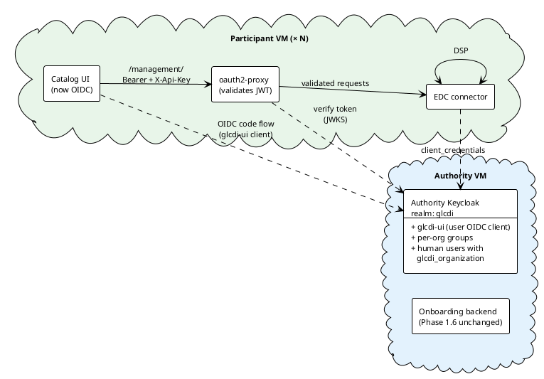

### Sequence - user login

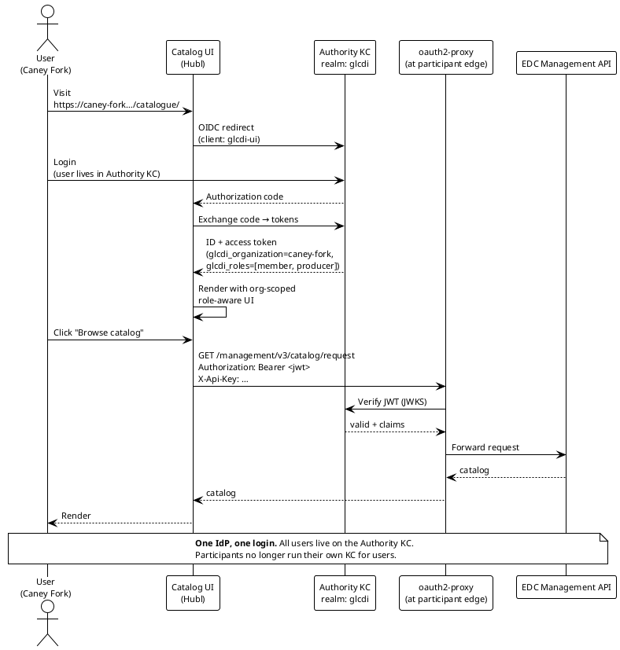

### Trade-offs of this phase

| Pro | Con |
|-----|-----|
| Per-user audit ("who at caney-fork pressed negotiate?"). | All user accounts are in the governance team's directory - participants depend on the governance team for HR cycles, password resets, role changes. |
| One IdP to operate, one set of SSO integrations. | A governance KC outage breaks every participant's UI login simultaneously. |
| Role-aware UI (the UI can show/hide views based on `glcdi_roles`). | Centralised user mgmt is at odds with the long-term self-sovereign direction. |

Phase 2 is operationally the simplest "users in the dataspace" model, and
the fastest to ship from where Phase 1.6 leaves us. It is *not* the
end-state - Phase 3 walks back the centralisation.

---

## Phase 3 - Local Keycloaks for proper user management

Phase 2's single-IdP model is operationally simple but politically heavy:
participants don't control their own user directories. Phase 3 federates
them.

Each participant deploys a local Keycloak alongside its EDC + Catalog UI
stack. The Authority KC stays in place as the dataspace's federation point,
but it no longer holds participant users - it brokers to each participant's
local KC over OIDC.

This is the flow the `CLAUDE.md` snippet under `## Authentication flow`
already sketches as the target end-state for non-VC identity. Phase 3 is
when that flow is real.

### What changes

- Each participant runs a local Keycloak (e.g. realm `caney-fork`). Its
  realm JSON lives in `participant-agent-services/` (already wired by the
  per-participant compose file).
- The Authority KC gains an identity provider entry per participant
  (OIDC brokering). `KC_IDP_HINT=<participant>` auto-redirects governance
  logins to the right local KC.
- The Catalog UI does a **two-tier OIDC flow**: governance login first (for
  audit + federation), then a silent participant-KC token (for
  `/management/` calls).
- The onboarding backend's approval step now provisions:
  - the IdP entry on the Authority KC (so brokering works), and
  - the initial participant-admin user on the local KC.
  Day-to-day user mgmt (additional users, password resets, role changes)
  happens at the participant level.

### What does not change

- All EDC-side machinery (policies, claim shapes, DSP trust) is identical to
  Phases 1–2.
- The connector-to-connector trust still uses `client_credentials` against
  the Authority KC. (Tier-3 / Phase 4 is what unwinds that.)

### Architecture

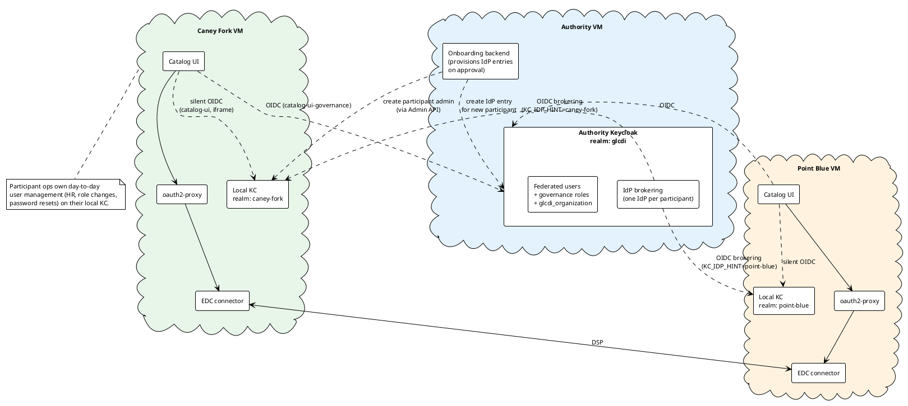

### Sequence - two-tier login

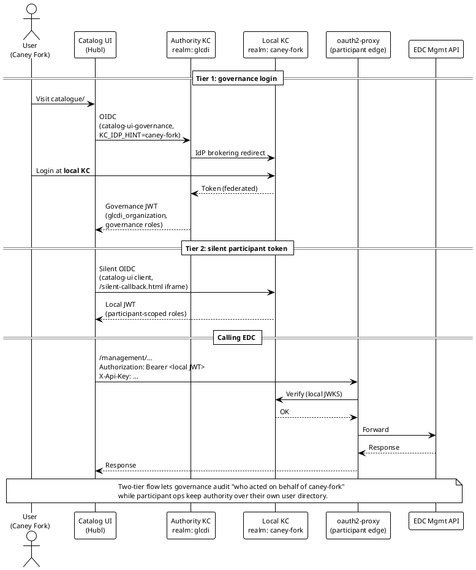

### Why bother with the two tiers?

The naive simpler approach would be "the Catalog UI logs into the local KC
directly, end of story." That works, but it loses two things:

1. **Federated audit** at the governance layer. Today (Phase 1) and at Phase
   2, Authority KC sees every interaction. If Phase 3 drops the governance
   tier entirely, governance loses visibility into which users at which orgs
   are participating in which DSP exchanges.
2. **A single SSO entry point** for governance tooling. The onboarding
   dashboard, the future contract-management UI, the certification status
   tooling - they all live on the governance VM and want to authenticate
   against Authority KC, not against N different participant KCs.

The two-tier flow keeps those properties while delegating user mgmt to the
participant who actually owns the org. The silent participant-KC step is
specifically so the `/management/` edge can be locked down by an oauth2-proxy
that the participant operator controls.

---

## Phase 4 - OID4VCI / OID4VP

This is the long-term direction described in
[`IDENTITY.md § Tier 3`](IDENTITY.md#tier-3--decentralised-claims-via-vc--dcp).
The Authority Keycloak (and the per-participant KCs from Phase 3) step out
of the runtime trust path; users hold W3C Verifiable Credentials in their
wallets, connectors hold VCs in their Identity Hubs, and verifiers check
signatures + trust lists instead of JWKS endpoints.

### What changes

- The Authority KC becomes (or is supplemented by) a **OID4VCI issuer**.
  Implementations: Walt.id Issuer, the KC OID4VC plugin, or a custom
  issuer; the choice tracks the EUDI ARF and is not committed yet.
- An **issuer-DID trust list** replaces the JWKS endpoint as the trust
  anchor. The trust list is itself a governance artefact (which DIDs may
  issue which credential type).
- **EDC connectors** switch from `glcdi-iam-keycloak` to
  `iam-identity-trust` (or equivalent DCP-aware) and exchange Verifiable
  Presentations during DSP handshakes instead of KC-issued JWTs.
- **The Catalog UI** becomes an **OID4VP verifier**: users present VPs
  from a wallet (EUDI Wallet or compatible holder) to log in.
- **The onboarding backend's approval step** triggers VC issuance into the
  applicant's wallet rather than provisioning a user on a Keycloak.

### What does not change

- The `glcdi_*` claim **names** and the **EDC policy functions** are
  untouched. They read claims out of `ParticipantAgent` regardless of
  whether the issuer was a KC JWT or a VC.
- The role catalogue (`glcdi_member`, `glcdi_producer`, etc.) and the
  `glcdi_organization` attribute become VC types / properties rather than
  KC roles / attributes, but the policy logic that reads them is the same.

### Architecture

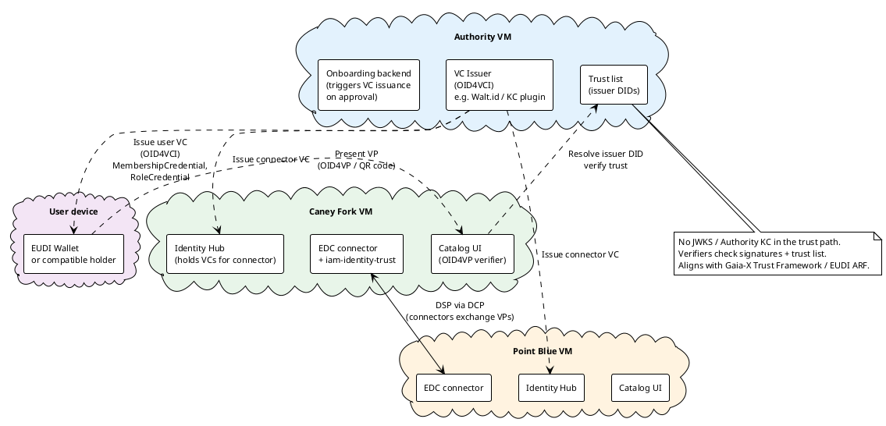

### Sequence - VC issuance (OID4VCI)

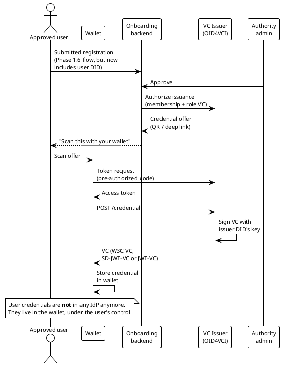

### Sequence - VP presentation (OID4VP)

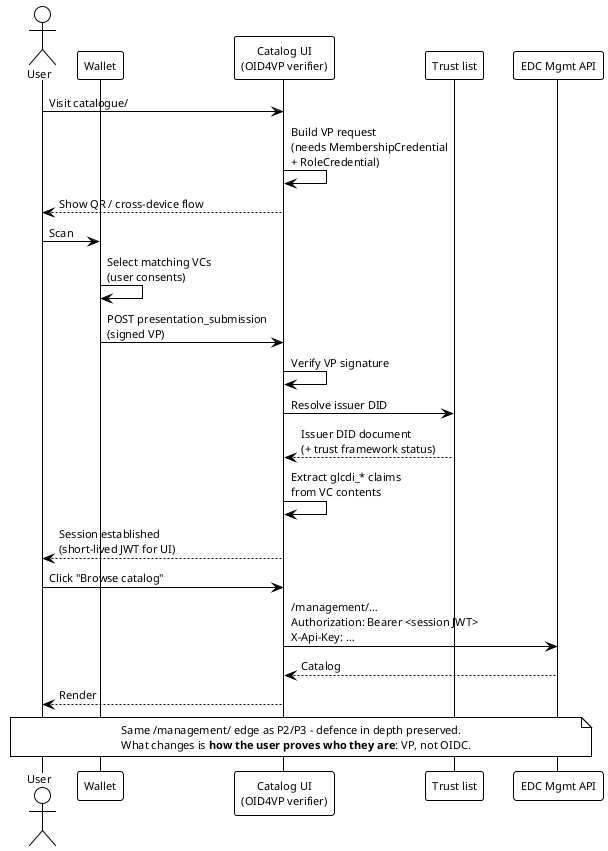

### Why this is a long-term phase, not a near-term one

The IDENTITY.md analysis already covers why OIDC (and not OID4VC) is the
right choice for the prototype - short version: the OID4VC specs are still
Implementer's Drafts, the wallet ecosystem is not in production at user
scale, and the trust frameworks (EUDI, Gaia-X) are still firming up.

What Phase 4 here adds to that analysis is the operational shape - what the
deployment looks like when the time comes. The path from Phase 3 to Phase 4
is mostly *replacing* components, not adding new ones:

- Authority KC → issuer (or kept around in a reduced "issuer of last resort"
  role).
- `glcdi-iam-keycloak` → `iam-identity-trust` (in EDC).
- Catalog UI OIDC client → Catalog UI VP verifier.
- Per-participant Keycloaks (Phase 3) → either removed entirely or repurposed
  as participant-local credential issuers under the same trust list.

The fact that the claim shape (and therefore the EDC policy functions)
survive intact across all four phases is the load-bearing design choice
that makes this roadmap incremental rather than a series of rewrites.

---

## How to regenerate the diagrams

The PlantUML sources above are the canonical form. The HTML presentation
embeds them as rendered SVGs via the public PlantUML server; the URLs are
deterministic deflate+base64 encodings of the same sources, so editing a
diagram and pasting the new URL into `AUTHENTICATION.html` is the whole
workflow.

For a one-off edit of a single diagram, pipe its `@startuml … @enduml` into
the encoder:

```bash
cd /var/home/balessan/Workspaces/Dataspaces/glcdi
python3 management/scripts/plantuml-encode.py < my-diagram.puml
```

For bulk edits, `management/scripts/generate-auth-diagrams.py` holds every
diagram in one place. Edit the matching `DIAGRAMS["…"]` entry, then:

```bash
python3 management/scripts/generate-auth-diagrams.py
```

It prints a JSON map of `{diagram-key: plantuml-server URL}`. Paste the
URL for the changed diagram into the matching `` in
`AUTHENTICATION.html`, and sync the PlantUML source back into this file's
`` ```plantuml `` fence.
