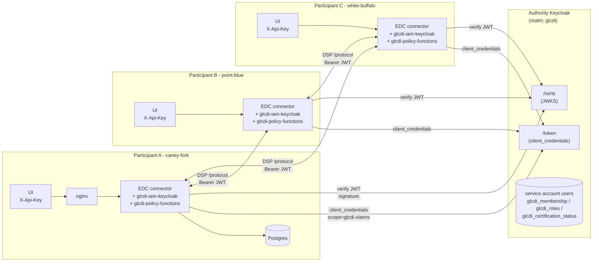
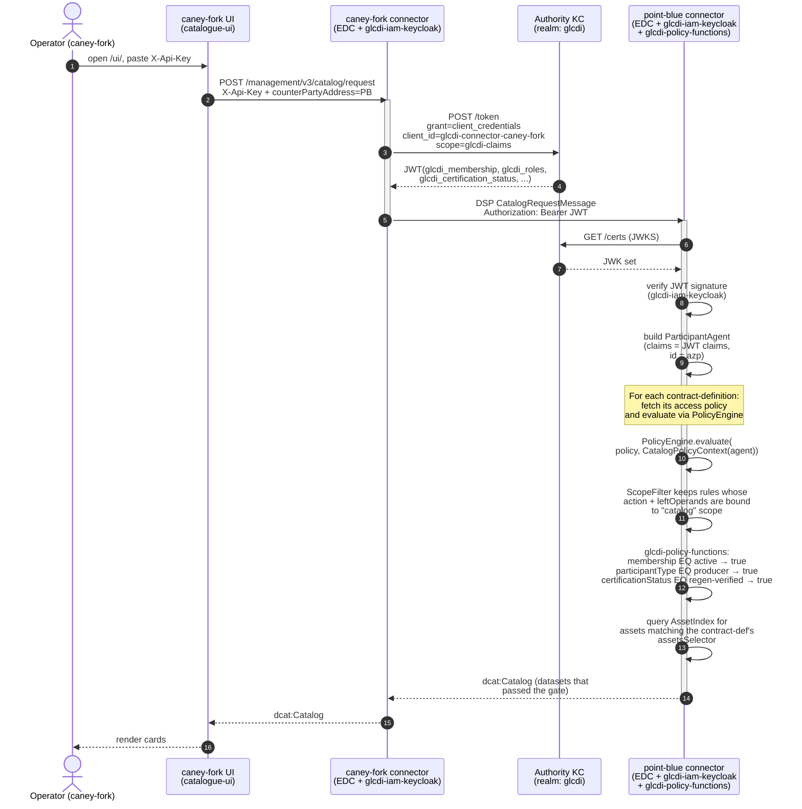

# GLCDI Identity & Authentication

Identity management, authentication, and the technical standards the dataspace relies on for them. Consolidated here so the architecture, rationale, and standards mapping live in one place.

For the overall governance model and policy design this feeds into, see [`README.md`](README.md). For the step-by-step implementation plan (realm JSON, protocol mappers, EDC policy functions), see [`IMPLEM_PLAN.md`](IMPLEM_PLAN.md) - Phase 2 covers Keycloak claim configuration and Phase 3 covers the EDC-side claim extraction.

## Architecture

GLCDI's identity model is **tiered**: the M1 prototype ships on Tier 1 (the smallest credible model that makes the policy stack work), and richer identity layers on as governance / audit needs justify it. The three tiers (defined in [`IMPLEM_PLAN.md` § Identity Tiering Strategy](IMPLEM_PLAN.md#identity-tiering-strategy)) share the same Authority Keycloak realm and the same `glcdi_*` claim shape; each tier adds a credential surface on top of the previous one.

### Tier 1 - Connector-only auth (M1 default)

```
                        ┌──────────────────────────────────┐
                        │  Authority Keycloak (glcdi realm) │
                        │                                   │
                        │  Source of truth for:              │
                        │  - GLCDI membership                │
                        │  - Participant roles               │
                        │  - Certification + contribution    │
                        │                                   │
                        │  Clients (Tier-1 load-bearing):    │
                        │  ├── glcdi-connector-caney-fork    │
                        │  ├── glcdi-connector-point-blue    │
                        │  └── glcdi-connector-white-buffalo │
                        │                                   │
                        │  Each → service-account user with  │
                        │         glcdi_* roles + attributes │
                        └──────────┬───────────────────────┘
                                   │ client_credentials → JWT
                    ┌──────────────┼──────────────┐
                    │              │              │
          ┌─────────▼──┐  ┌───────▼────┐  ┌─────▼────────┐
          │ Participant │  │ Participant│  │ Participant  │
          │  A          │  │  B         │  │  C           │
          │ ┌─────────┐ │  │ ┌────────┐ │  │ ┌─────────┐  │
          │ │connector│ │  │ │connect.│ │  │ │connector│  │
          │ │+ id-hub │ │  │ │+ id-hub│ │  │ │+ id-hub │  │
          │ └────▲────┘ │  │ └───▲────┘ │  │ └────▲────┘  │
          │      │ Bearer JWT (DSP) <-- iam-oauth2 -->    │
          │      │      │  │     │      │  │      │      │
          │ ┌────┴────┐ │  │ ┌───┴────┐ │  │ ┌────┴────┐  │
          │ │ UI      │ │  │ │ UI     │ │  │ │ UI      │  │
          │ │ + nginx │ │  │ │+ nginx │ │  │ │+ nginx  │  │
          │ │X-Api-Key│ │  │ │X-Api-K │ │  │ │X-Api-Key│  │
          │ └─────────┘ │  │ └────────┘ │  │ └─────────┘  │
          └─────────────┘  └────────────┘  └──────────────┘
```

**At Tier 1 the management-API edge has only `X-Api-Key`.** No oauth2-proxy, no Bearer token, no end-user OIDC anywhere. The catalogue UI is a per-org tool - operators paste an API key on first load. Trust boundary is the per-participant network. Connector ↔ connector trust runs over the custom `glcdi-iam-keycloak` extension against the Authority KC: each connector requests a JWT via `client_credentials` against its `glcdi-connector-<org>` client, the JWT carries the org's `glcdi_*` claims, the receiving connector validates against Authority KC's JWKS and extracts claims into `ClaimToken` for policy evaluation. § 3.5 of the implementation plan is the swap from `iam-mock` to `glcdi-iam-keycloak` - the load-bearing gate to "real auth" between connectors. (EDC 0.15.x retired the standalone `iam-oauth2` extension; the `controlplane-dcp-bom` it replaced it with assumes Verifiable Presentations, so we hand-rolled a small OAuth2 IdentityService implementation - see `edc-glcdi-extension/extensions/glcdi-iam-keycloak/`.)

#### Tier-1 architecture (Mermaid)



#### Tier-1 catalog-query sequence (Mermaid)

End-to-end flow for an operator at caney-fork browsing the dataspace catalog of a peer (e.g. point-blue). The same path drives contract negotiation and transfer once the catalog returns a dataset.



The receiver-side gate sits at steps 9–13: claims have to flow through `glcdi-iam-keycloak` into `ParticipantAgent`, the `ScopeFilter` has to keep the rule (binding action + left-operands to `catalog` scope), and each `glcdi-policy-functions` constraint has to return `true`. Any link in that chain failing silently empties the catalog - which is exactly the diagnostic flow `IMPLEM_PLAN.md § 3.6` walks through.

### Tier 2 - Add user OIDC at the UI (post-M1, optional)

```
                        ┌──────────────────────────────────┐
                        │  Authority Keycloak (glcdi realm) │
                        │                                   │
                        │  Adds (on top of Tier 1):          │
                        │  Clients:                          │
                        │  └── glcdi-ui (user-OIDC client)   │
                        │  Groups (per-organisation):        │
                        │  ├── caney-fork-team               │
                        │  ├── point-blue-team               │
                        │  └── white-buffalo-team            │
                        │  Human users joined to groups -    │
                        │  inherit roles + attributes        │
                        └──────────┬───────────────────────┘
                                   │ OIDC user login (UI tier)
                                   │ + client_credentials (DSP tier - unchanged)
                    ┌──────────────┼──────────────┐
                    │              │              │
          ┌─────────▼──┐  ┌───────▼────┐  ┌─────▼────────┐
          │ Participant │  │ Participant│  │ Participant  │
          │ ┌────────┐  │  │ ┌────────┐ │  │ ┌────────┐   │
          │ │connector│ │  │ │connector│ │  │ │connector│  │
          │ └───▲────┘  │  │ └───▲────┘ │  │ └───▲────┘   │
          │     │ Bearer (DSP, same as Tier 1)            │
          │ ┌───┴────┐  │  │ ┌───┴────┐ │  │ ┌───┴────┐   │
          │ │oauth2- │  │  │ │oauth2- │ │  │ │oauth2- │   │
          │ │ proxy  │  │  │ │ proxy  │ │  │ │ proxy  │   │
          │ └───▲────┘  │  │ └───▲────┘ │  │ └───▲────┘   │
          │     │ X-Api-Key + Bearer (user JWT)            │
          │ ┌───┴────┐  │  │ ┌───┴────┐ │  │ ┌───┴────┐   │
          │ │  UI    │  │  │ │  UI    │ │  │ │  UI    │   │
          │ └────────┘  │  │ └────────┘ │  │ └────────┘   │
          └─────────────┘  └────────────┘  └──────────────┘
```

**Tier 2 layers user OIDC on top of Tier 1** - adding the `glcdi-ui` client, per-org groups, human users, and oauth2-proxy in front of `/management`. Connector ↔ connector trust is unchanged. Per-user audit ("who at caney-fork pressed negotiate") becomes possible; UI views can role-gate per user. The `X-Api-Key` floor stays in place - at Tier 2 both the user Bearer token *and* the API key gate `/management`. Detailed steps live in [`IMPLEM_PLAN § 7.2`](IMPLEM_PLAN.md#phase-72-identity-tier-2--add-user-oidc-at-the-ui).

### Tier 3 - Decentralised claims via VC / DCP (long-term)

```
                ┌─────────────────────────────────────────────┐
                │  GLCDI Trust Anchors                         │
                │                                             │
                │  Dataspace Authority issues VCs:             │
                │  - MembershipCredential                      │
                │  - RoleCredential                            │
                │  - CertificationStatusCredential             │
                │  - ContributionStatusCredential              │
                │                                             │
                │  Trust list: which DIDs may issue what?      │
                │  → no central JWKS endpoint                  │
                └──────────┬──────────────────────────────────┘
                           │ VC issuance (out-of-band; one-shot per claim)
                           │
                ┌──────────▼─────────────┐  ┌──────────────────────┐
                │ Participant A          │  │ Participant B        │
                │ DID: did:web:caney-fork│  │ DID: did:web:white-… │
                │ Identity Hub (held VCs)│  │ Identity Hub (VCs)    │
                │ ┌────────────────────┐ │  │ ┌──────────────────┐ │
                │ │ connector +        │ │  │ │ connector +      │ │
                │ │ iam-identity-trust │ │  │ │ iam-identity-tr. │ │
                │ │                    │◄┼──┼─┤                  │ │
                │ │  Verifiable        │ │  │ │  Verifiable      │ │
                │ │  Presentation      │ │  │ │  Presentation    │ │
                │ │  exchange via DCP  │ │  │ │  exchange via DCP│ │
                │ └────────────────────┘ │  │ └──────────────────┘ │
                └────────────────────────┘  └──────────────────────┘
```

**Tier 3 replaces the Authority Keycloak as the issuer of connector credentials.** Connectors hold W3C Verifiable Credentials in their Identity Hub; DSP handshakes exchange Verifiable Presentations rather than Authority-KC-issued JWTs. The `glcdi_*` claim *names* and the policy functions are unchanged - they read claims from `ParticipantAgent`, indifferent to whether the issuer was a Keycloak JWT or a VC. What changes is who *signs* the claims, and how trust is anchored: Authority KC's JWKS endpoint goes away; in its place is a trust list of issuer DIDs (a governance artefact). Detailed migration in [`IMPLEM_PLAN § 7.3`](IMPLEM_PLAN.md#phase-73-identity-tier-3--decentralised-claims-via-vc--dcp).

### Why this tiered roadmap

1. **Smallest credible identity model first.** M1's pass/fail signal is about the policy stack, not about whether OIDC iframe redirects worked. Tier 1 deliberately removes everything that isn't load-bearing for that signal.
2. **Org-level claims are sufficient for the M1 policies.** Every claim the M1 access/contract policies evaluate (`glcdi_membership`, `glcdi_roles`, `glcdi_certification_status`) is an organisation property, not a per-user property. Putting them on per-org service accounts is the natural shape.
3. **Each tier is additive.** Tier 2 layers user OIDC in front of Tier 1's connector path without disturbing the connector trust chain. Tier 3 swaps out the issuer at the connector path while leaving the policy functions untouched.
4. **Avoid investing heavily in plumbing Tier 3 will obsolete.** The two-tier user-OIDC scaffolding (per-participant brokering, IdP federation mappers) was deferred from M1 to Tier 2 because Tier 3 eventually replaces the central Keycloak as the issuer anyway - building deep KC-federation mappers ahead of M1 was investing in something the long-term direction would unwind.

## Participant Identity Claims

Each participant's identity token carries three GLCDI-specific claims:

| Claim | Type | Source | Purpose |
|-------|------|--------|---------|
| `glcdi_membership` | String | Hardcoded mapper (prototype) or user attribute | Checked by all access policies - is this participant an active member? |
| `glcdi_roles` | String array | Realm role mapper (prefix `glcdi_`) | Determines participant type - producer, researcher, data steward, etc. |
| `glcdi_certification_status` | String | User attribute mapper | Regenerative certification - used by the `regenerative-producers` access policy |

## Realm Roles

| Role | Assigned to | What it unlocks |
|------|------------|-----------------|
| `glcdi_member` | All onboarded participants | Access to `members-only` offers |
| `glcdi_producer` | Ranches / farming organisations with regenerative certification | Access to `regenerative-producers-only` offers, peer-to-peer benchmarking. Combined with `glcdi_certification_status = regenerative-verified` for full record. |
| `glcdi_producer` | Ranches / farming organisations not (yet) regenerative-certified | Generic producer access (broader than `regenerative-producers-only`); used when a policy admits all producers regardless of certification |
| `glcdi_researcher` | Universities, research NGOs | Access to `researchers-only` offers (e.g., raw SOC data for model training) |
| `glcdi_data_steward` | Monitoring alliances | Access to `researchers-only` offers, data stewardship role |
| `glcdi_conservation_org` | Conservation organisations | General membership access |
| `glcdi_technology_provider` | Ag-tech platforms, MRV tools | General membership access |
| `glcdi_corporate` | Food companies, ESG teams | Access to `corporate-partners` offers |
| `glcdi_certification_body` | Certification/verification bodies | Access to `corporate-partners` offers |
| `glcdi_supply_chain_partner` | Procurement, Scope 3 analysts | Access to `corporate-partners` offers |
| `glcdi_funder` | Funding bodies / public sector partners | General membership access |

## Proposed Participant Role Assignments

Specific participant-to-role assignments are left to onboarding time and are proposed (not yet finalised) to follow this pattern:

| Participant type | Proposed roles | Proposed certification |
|------------------|---------------|-----------------------|
| Regenerative producer | `glcdi_member` + `glcdi_producer` | `regenerative-verified` |
| Non-regenerative producer | `glcdi_member` + `glcdi_producer` | `organic-certified`, `transitioning-organic`, `conventional`, or `not-applicable` |
| Research institution | `glcdi_member` + `glcdi_researcher` | `not-applicable` |
| Data steward / monitoring alliance | `glcdi_member` + `glcdi_data_steward` | `not-applicable` |

Additional participant types (`conservation_org`, `technology_provider`, `corporate`, `certification_body`, `supply_chain_partner`, `funder`) would follow the same pattern as their declared type role is added, with certification status set to `not-applicable` unless they hold a recognised regenerative/organic credential.

## Onboarding Flow (Proposed)

These are the proposed onboarding flows, to be validated with the Dataspace Authority before implementation. The flow at each tier:

### Tier 1 (M1) - out-of-band, connector-only

```
1. Participant submits application  ──→  Onboarding app (authority-services)
2. Dataspace Authority reviews
3. On approval (proposed actions):
   a. Authority operator extends realm JSON: new `glcdi-connector-<org>` client +
      service-account user with appropriate `glcdi_*` realm roles + attributes
   b. Realm JSON re-imported (or live-edited via admin console) per DEPLOYMENT.md § 2.2
   c. Rotated client_id / client_secret shipped to participant via vault / OOB channel
4. Participant operator drops client_id / client_secret into participant/configuration.properties,
   restarts connector → can publish assets, query catalogs, negotiate contracts
```

No human user accounts at this tier - onboarding produces a *connector identity*, not an operator identity. Operators access their own connector's UI with `X-Api-Key`.

### Tier 2 (post-M1, optional) - adds human user creation

```
1. Participant submits application  ──→  Onboarding app (authority-services)
2. Dataspace Authority reviews     ──→  Approval UI (proposed)
3. On approval (proposed actions, automated via Keycloak Admin API):
   a. Per-org group created if not already there (e.g., caney-fork-team) with
      `glcdi_member` + participant-type role + organisation attribute
   b. Human user created and joined to the org's group
   c. Per-user attributes set (certification + contribution status)
   d. Connector service-account client from Tier-1 onboarding stays in place - unchanged
4. Participant operator receives credentials  ──→  Can authenticate via UI and access catalog
```

The Tier-2 flow does not regenerate the Tier-1 connector identity - it adds a human-user surface alongside it. See [`IMPLEM_PLAN § 7.2.5`](IMPLEM_PLAN.md#725-tier-2-onboarding-flow).

---

## Identity Standards Mapping

Each identity / authentication mechanism in GLCDI is backed by one or more open specifications. This table maps **what the dataspace does** to **which standard enables it**.

| Mechanism | What it does in GLCDI | Specification | How it's used |
|-----------|----------------------|---------------|---------------|
| **OAuth2 client_credentials flow** (Tier 1, M1) | Each connector authenticates as itself against Authority KC; the resulting JWT is what it presents on outbound DSP requests | [OAuth 2.0](https://datatracker.ietf.org/doc/html/rfc6749) + [JWT (RFC 7519)](https://datatracker.ietf.org/doc/html/rfc7519) | One `glcdi-connector-<org>` client per participant; service-account user carries `glcdi_*` claims that flow into the JWT via the `glcdi-claims` scope mappers. |
| **Token-based authorisation** (Tier 1+) | Identity claims carried in signed tokens, evaluated by provider's connector | [OAuth 2.0](https://datatracker.ietf.org/doc/html/rfc6749) + [JWT (RFC 7519)](https://datatracker.ietf.org/doc/html/rfc7519) | Access tokens contain `glcdi_roles`, `glcdi_membership`, `glcdi_certification_status`, `glcdi_contribution_status` claims. EDC policy functions extract and evaluate them, regardless of issuer (Authority KC at Tier 1+2, VC at Tier 3). |
| **Role-based access control** (Tier 1+) | Participant type (producer, researcher, corporate) determines catalog visibility | [OIDC Claims](https://openid.net/specs/openid-connect-core-1_0.html#Claims) via Keycloak realm roles | `members-only.json`, `researchers-only.json`, `regenerative-producers.json`. Roles serialised as JWT claims. |
| **OpenID Connect** (Tier 2) | Operators authenticate at the Authority Keycloak via the UI, organisations modelled as groups | [OpenID Connect Core 1.0](https://openid.net/specs/openid-connect-core-1_0.html) | Single-tier OIDC against Authority KC only. `glcdi-ui` is the OIDC client; user JWTs carry the same claim shape as the Tier-1 connector JWTs. |
| **Decentralised identity** (Tier 3) | Participants identified by DIDs, claims carried in Verifiable Credentials | [W3C DID Core 1.0](https://www.w3.org/TR/did-core/) + [W3C VC Data Model 2.0](https://www.w3.org/TR/vc-data-model-2.0/) | Currently `did:web:<participant>.glcdi.startinblox.com` is configured in EDC but VCs are not yet issued. The DCP-shaped config (`edc.iam.issuer.id`, `edc.iam.sts.oauth.token.url`) is the placeholder for this direction. |
| **Gaia-X compliance** (Tier 3 alignment) | Self-descriptions, trust anchors, credential issuance aligned with Gaia-X | [Gaia-X Trust Framework](https://docs.gaia-x.eu/policy-rules-committee/trust-framework/) | GLCDI architecture is designed to be Gaia-X-compatible (Self-Descriptions, Federated Catalogue, Compliance Service); full alignment lands with Tier 3. |

---

## Why OpenID Connect (and not OID4VC / Verifiable Credentials)

The GLCDI prototype uses **OpenID Connect (OIDC)** with Keycloak for identity management
rather than the newer OID4VC (OpenID for Verifiable Credentials) stack. This is a deliberate
choice, not a shortcut. This section explains the reasoning.

### What is OIDC?

[OpenID Connect Core 1.0](https://openid.net/specs/openid-connect-core-1_0.html) is an
identity layer on top of OAuth 2.0. It lets a client application verify a user's identity
based on authentication performed by an authorisation server, and obtain basic profile
information in an interoperable way. It is the most widely deployed federated identity
standard on the web.

In GLCDI, OIDC's underlying OAuth 2.0 + JWT machinery is used at two levels, **introduced one tier at a time**:

1. **Connector-to-connector authorisation (Tier 1, M1)** - each connector authenticates as itself via `client_credentials` against its `glcdi-connector-<org>` client and presents the resulting JWT on outbound DSP requests; the provider's connector validates the JWT against the Authority KC's JWKS and extracts `glcdi_*` claims to evaluate policies. This is the only identity surface at M1.
2. **Operator authentication via OIDC (Tier 2, post-M1, optional)** - each participant's operators authenticate against the Authority Keycloak via the `glcdi-ui` client and receive a JWT carrying their org's claims via group membership. Adds per-user audit and role-gated UI views; layers on top of (does not replace) the Tier-1 connector path.

### What is OID4VC?

The OID4VC family is a set of newer specifications building on OIDC to support
**Verifiable Credentials (VCs)** and **Decentralised Identifiers (DIDs)**:

| Specification | Purpose | Status (as of March 2026) |
|---------------|---------|--------------------------|
| [OID4VCI](https://openid.net/specs/openid-4-verifiable-credential-issuance-1_0.html) (OpenID for Verifiable Credential Issuance) | How an issuer delivers a VC to a holder's wallet | Implementer's Draft. Active development, not yet a final standard. |
| [OID4VP](https://openid.net/specs/openid-4-verifiable-presentations-1_0.html) (OpenID for Verifiable Presentations) | How a holder presents a VC to a verifier | Implementer's Draft. Several interop profiles exist but no convergence yet. |
| [SIOPv2](https://openid.net/specs/openid-connect-self-issued-v2-1_0.html) (Self-Issued OpenID Provider v2) | Holder acts as their own OIDC provider using a DID | Implementer's Draft. Minimal production adoption. |
| [W3C DID Core 1.0](https://www.w3.org/TR/did-core/) | Decentralised Identifiers | W3C Recommendation, but the DID method ecosystem is fragmented (`did:web`, `did:key`, `did:ion`, etc.). |
| [W3C VC Data Model 2.0](https://www.w3.org/TR/vc-data-model-2.0/) | Verifiable Credentials structure | W3C Recommendation. The data model is stable, but the encoding (JSON-LD vs JWT-VC vs SD-JWT-VC) and trust frameworks around it are not settled. |

### Why OIDC is the right choice for the GLCDI prototype

**1. Production maturity**

OIDC has been a final specification since 2014. Every major identity provider implements it
(Keycloak, Auth0, Azure AD, Okta, Google). Libraries exist for every language. Debugging tools
are abundant. The failure modes are well-understood.

OID4VC, by contrast, is still in Implementer's Draft status. The specifications are actively
changing. Breaking changes between drafts are common. The number of production deployments
is extremely limited - mostly pilot projects and government-backed identity wallets (EUDIW)
that are not yet generally available.

**2. Wallet ecosystem is not ready**

OID4VC assumes participants have a **credential wallet** - an application that holds VCs and
can present them on demand. As of early 2026:
- There is no dominant open-source wallet with production-grade stability
- Wallet interoperability (accepting VCs from different issuers, in different formats) is
  still being tested in interop events, not in production
- GLCDI participants (ranchers, small research NGOs) do not have organisational wallets
  and cannot be expected to set one up for a 9-month prototype

**3. Credential format fragmentation**

The VC ecosystem has not converged on a single credential format:
- **JSON-LD VCs** (W3C VC Data Model with JSON-LD proofs)
- **JWT-VC** (VC wrapped in a JWT, used by Microsoft Entra Verified ID)
- **SD-JWT-VC** (Selective Disclosure JWT, gaining traction in EUDIW/HAIP)
- **mdoc/mDL** (ISO 18013-5, used for mobile driving licenses)

EDC itself is navigating this fragmentation. The EDC Identity Hub supports `did:web` and
JWT-based VCs, but the integration points with OID4VCI/OID4VP are experimental and evolving
with each EDC release. Building on this moving target for a prototype with a fixed deadline
(September 2026) would introduce significant delivery risk.

**4. Trust anchors are undefined for agriculture**

OID4VC works best when there is a **trust framework** that defines who can issue credentials,
what credentials mean, and how verifiers should evaluate them. In the European context,
this is being built by eIDAS 2.0 and the EU Digital Identity Wallet Architecture (ARF).
In the U.S. agricultural context, no such framework exists. There is no recognised authority
that would issue a "regenerative-verified producer" credential that other participants would
trust. GLCDI would have to build this from scratch - which is a governance problem, not a
technology problem.

With OIDC + Keycloak, the proposal is that the **Authority Keycloak serves as the trust anchor**. Under this proposal the Dataspace Authority would approve participants and the realm admin would assign group memberships and roles - simple, auditable, and sufficient for a small participant set.

**5. OAuth2 + OIDC gives us everything we need now**

For the GLCDI prototype, the M1 identity requirements are:
- Authenticate connectors against the Authority Keycloak (**OAuth 2.0 `client_credentials`** does this - Tier 1)
- Carry organisation type, membership, certification status in tokens (**JWT claims** do this)
- Evaluate claims in EDC policy functions (**JWT extraction** does this)
- (Post-M1, optional) authenticate human operators in front of the UI (**OIDC** does this - Tier 2)

There is no functional requirement that OAuth 2.0 + OIDC cannot satisfy for the prototype scope. Adding VCs in front of either the M1 connector identity (Tier 3) or the post-M1 user identity (also Tier 3) is the long-term direction once the trust-anchor governance and wallet ecosystem mature.

### Migration path to OID4VC

The OAuth2-first approach does not close the door on VCs. The tier roadmap is designed for
incremental migration:

```
Tier 1 (M1, 2026)                Tier 2 (post-M1, optional)         Tier 3 (long-term, 2027+)
─────────────────                ───────────────────────────         ─────────────────────────
Connector SAs in Authority KC  → (unchanged at this layer)        → VCs issued by Dataspace Authority
client_credentials JWT (DSP)   → (unchanged at this layer)        → VP tokens (DCP / OID4VP)
JWKS validation at receiver    → (unchanged at this layer)        → DID-based trust anchors +
                                                                     Gaia-X Compliance Service
X-Api-Key only at /management  → X-Api-Key + user OIDC Bearer     → (TBD by Tier-3 design)
                                  via glcdi-ui client
No human users in KC           → Per-org groups + human users     → Same surface; VCs replace
                                  in Authority KC                    KC-issued user JWTs
EDC IdentityService = oauth2   → oauth2 (unchanged)               → EDC Identity Hub resolves
                                                                     VCs from participant wallets
```

The policy definitions in `policies/` are **already expressed in ODRL**, which is
credential-format agnostic. The `leftOperand` values (`glcdi:membership`,
`glcdi:participantType`) remain the same whether the claim comes from a JWT issued
by Keycloak (Tiers 1–2) or from a VC issued by a future GLCDI credential authority (Tier 3).
Only the **policy function implementation** (how the claim is extracted from `ParticipantAgent`)
might need a small adjustment for VC-shaped data - the policy definitions and the constraint
functions' *logic* do not.

### References

| Specification | URL |
|---------------|-----|
| OpenID Connect Core 1.0 | https://openid.net/specs/openid-connect-core-1_0.html |
| OAuth 2.0 (RFC 6749) | https://datatracker.ietf.org/doc/html/rfc6749 |
| JWT (RFC 7519) | https://datatracker.ietf.org/doc/html/rfc7519 |
| OID4VCI (Implementer's Draft) | https://openid.net/specs/openid-4-verifiable-credential-issuance-1_0.html |
| OID4VP (Implementer's Draft) | https://openid.net/specs/openid-4-verifiable-presentations-1_0.html |
| SIOPv2 (Implementer's Draft) | https://openid.net/specs/openid-connect-self-issued-v2-1_0.html |
| W3C DID Core 1.0 | https://www.w3.org/TR/did-core/ |
| W3C VC Data Model 2.0 | https://www.w3.org/TR/vc-data-model-2.0/ |
| HAIP (High Assurance Interoperability Profile) | https://openid.net/specs/openid4vc-high-assurance-interoperability-profile-1_0.html |
| Gaia-X Trust Framework | https://docs.gaia-x.eu/policy-rules-committee/trust-framework/ |
| EDC Identity Hub | https://github.com/eclipse-edc/IdentityHub |

---

## Annex: Participant Identity Stack Comparison

This table compares the identity stack across the three tiers - from the simplest (Tier 1,
what GLCDI ships at M1) to the most decentralised (Tier 3, long-term target).

| | **Tier 1 - Connector-only OAuth2** (M1) | **Tier 2 - OAuth2 + user OIDC** (post-M1) | **Tier 3 - VC + DCP** (long-term) |
|---|---|---|---|
| **Identity provider** | Authority Keycloak - issues connector JWTs only | Authority Keycloak - issues connector + user JWTs | Dataspace Authority issues VCs; participants hold their own DID |
| **Credential format** | JWT (`client_credentials` grant) | JWT (user OIDC + connector `client_credentials`) | VC (JWT-VC, SD-JWT-VC, or JSON-LD VC) |
| **Trust anchor** | Authority Keycloak - proposed: Dataspace Authority manages connector clients + SA claims | Authority Keycloak - extended: per-org groups + human users alongside connector SAs | DID-based trust list managed by the Dataspace Authority; alignment with Gaia-X Compliance Service |
| **UI auth** | `X-Api-Key` only (no end-user identity in any KC) | `X-Api-Key` + user OIDC Bearer via `glcdi-ui` client | (TBD per Tier-3 design - likely `X-Api-Key` + DID-bound presentation) |
| **How provider verifies consumer** | Extract claims from connector's `client_credentials` JWT (post-§ 3.5: `iam-oauth2`) | Same DSP path as Tier 1 - connector JWTs unchanged; user JWTs sit in front of UI only | Resolve DID → verify Verifiable Presentation → extract claims |
| **Participant requirement** | One connector client + secret in Authority KC, distributed out-of-band | Tier 1 setup + a Keycloak human-user account per operator | DID, Identity Hub, VCs from trusted issuer(s) |
| **Onboarding complexity** | Low: realm-JSON edit per new participant; client secret distributed OOB | Medium: Tier-1 + automated user-provisioning via Keycloak Admin API | High: participant creates DID, requests VCs, configures Identity Hub |
| **Per-user audit** | No (org-level only - "someone at caney-fork pressed negotiate") | Yes (per-user JWT, audit log captures user identity) | Yes (presentation includes holder DID) |
| **Revocation** | Immediate: rotate connector client secret + remove role in Keycloak | Immediate (user) or by client-secret rotation (connector) | VC revocation list / status list (latency) |
| **EDC support** | `iam-oauth2` against Authority KC (mature, swap from `iam-mock` per § 3.5) | Same `iam-oauth2` (unchanged); oauth2-proxy in front of `/management` | `iam-identity-trust` (DCP / IATP), Identity Hub - experimental, evolving per release |
| **Maturity for production** | Production-ready (vanilla OAuth2 + Keycloak) | Production-ready | R&D / pilot |
| **Best for** | M1 - prototype with 3 managed participants | Mid-MVP, when per-user audit becomes a stakeholder ask | Scaled dataspace with autonomous participants joining without realm-JSON edits at the centre |

**GLCDI recommendation:** Ship M1 at Tier 1. Schedule Tier 2 if/when stakeholders ask for
per-user audit (no functional dependency on M1's content). Treat Tier 3 as a long-term
migration paced by EDC Identity Hub maturity, the Dataspace Authority's VC issuance pipeline,
and the wider Gaia-X / DSBA federation timeline.
