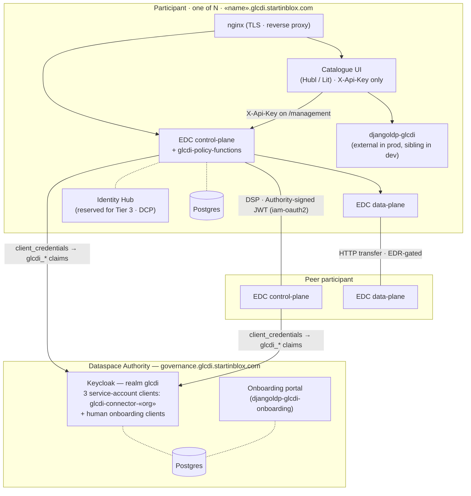

# GLCDI Dataspace Management

Governance, policy design, and identity management resources for the
**Grazing Lands Carbon Data Initiative (GLCDI)** dataspace.

This directory is the working space for designing the rules, roles, and trust mechanisms
that govern how data flows between participants. It is not a deployable service — it feeds
into the three deployable sub-projects of the GLCDI workspace:

| Sub-project | What it deploys | What it takes from here |
|-------------|----------------|------------------------|
| `edc-connector/` | EDC connector runtime | Custom policy function extension (Phase 3) |
| `governance-services/` | Keycloak, onboarding app | Realm roles, protocol mappers, user attributes (Phase 2) |
| `participant-agent-services/` | Per-participant stack | Policy-aware seeding scripts (Phase 4) |

## Contents

```
management/
├── README.md           # This file — governance overview
├── AUTHORITY.md        # Proposed responsibilities & operating mode of the Dataspace Authority
├── AUTHORITY_MIGRATION.md # Operator checklist for renaming the live governance-* infrastructure
├── IDENTITY.md         # Identity, authentication & standards (OIDC, OID4VC, Keycloak)
├── AUTHENTICATION.md   # Two-tier authentication design and migration phases
├── DEPLOYMENT.md       # Deployment topology, staging URLs, per-VM layout
├── STANDARDS.md        # Trust & control mechanisms — specification mapping (ODRL, DSP, DCAT, JSON-LD)
├── PAYMENT_GATING.md   # Implementation design for the payment-required contract policy (proposal)
├── AGENTS.md           # Context file for AI agents
├── IMPLEM_PLAN.md      # Implementation plan (7 phases)
└── policies/
    ├── README.md       # Policy catalogue documentation
    ├── access/         # Access policies (catalog visibility)
    ├── contract/       # Contract policies (usage terms)
    ├── combined/       # End-to-end scenario examples
    └── diagrams/       # PlantUML sequence diagrams
```

---

## Architecture at a glance

GLCDI runs on a **one Authority + N participants** topology. The Authority publishes governance — identity, realm roles, membership — and hosts the onboarding portal. Each participant deploys the same Compose stack, exposes its datasets to peers via the Dataspace Protocol (DSP), and serves its Catalogue UI on a subdomain of `glcdi.startinblox.com`.

Identity ships in **tiers**. The diagram below shows **Tier 1** — the M1 target — where the *only* auth at the UI edge is an `X-Api-Key`, and the *only* auth on the DSP edge is a JWT the connector mints for itself against the Authority Keycloak. Tier 2 (per-user OIDC at the UI) and Tier 3 (Verifiable Credentials via DCP) are deliberately deferred; see [`IMPLEM_PLAN.md` § Identity Tiering Strategy](IMPLEM_PLAN.md#identity-tiering-strategy).



### What each block is

| Block | Sub-project (repo) | What it runs |
|-------|--------------------|--------------|
| Authority Keycloak | `governance-services/` | Realm `glcdi` — realm roles, claim mappers, one `glcdi-connector-«org»` service-account client per participant connector, plus the human onboarding clients |
| Onboarding portal | `governance-services/` | Public registration form + Django admin approval; provisions KC group / user / roles on approval (`djangoldp-glcdi-onboarding`) |
| EDC control-plane + extensions | `edc-connector/` + `edc-glcdi-extension/` | DSP endpoints, policy evaluation, contract negotiation. `edc-glcdi-extension/` sources are copy-merged into `edc-connector/extensions/` at CI build time |
| EDC data-plane | `edc-connector/` | HTTP data-plane, EDR-gated dataset delivery |
| Identity Hub | `participant-agent-services/` | VC/DCP-shaped subsystem — deployed but not on the M1 critical path; reserved for Tier 3 |
| Catalogue UI | `participant-ui/` (also cloned as `orbit/`) | Single runtime-configurable image, themed per participant at container start |
| djangoldp-glcdi | External per-participant deployment in staging/prod; sibling container in dev | LDP dataset side-channel used by the UI |
| nginx | `participant-agent-services/` | TLS termination and reverse proxy — no oauth2-proxy at Tier 1 |

### How the flows connect (Tier 1)

- **UI ↔ local connector.** Every management-API call from the Catalogue UI carries an `X-Api-Key` header validated by the connector. There is no Bearer token, no OIDC redirect, no silent-callback iframe. The trust boundary is the per-participant network; operators are trusted at their own participant.
- **Connector ↔ Authority (start-up).** On boot, each connector runs a `client_credentials` grant against the Authority realm using `glcdi-connector-«org»` and caches the resulting JWT, which carries `glcdi_membership`, `glcdi_roles`, `glcdi_certification_status`, `glcdi_contribution_status`, and `glcdi_organisation` claims.
- **Connector ↔ Connector (DSP).** The consumer connector attaches its cached JWT as `Authorization: Bearer …` on DSP requests. The provider's EDC (once `iam-mock` is swapped for `iam-oauth2` in Phase 3.5) verifies the signature against the Authority JWKS and surfaces the `glcdi_*` claims to the policy engine, which evaluates access and contract policies against them.
- **Data transfer.** On `FINALIZED` the consumer obtains an EDR from the provider's data-plane and calls its EDR-gated endpoint for the bytes. Browser-side consumers require a per-origin CORS setup (echoed `Access-Control-Allow-Origin` + `Allow-Credentials`).
- **Enforcement boundary.** Access filtering and contract-constraint evaluation happen inside the connector. Anonymisation, attribution, retention, and non-redistribution are governance-enforced via the Data Sharing Agreement — see the [Technical vs. Governance Enforcement](#technical-vs-governance-enforcement) table below.

### How Tier 2 and Tier 3 would evolve this picture

- **Tier 2 (Phase 7.2)** would add per-user OIDC at the UI. A single `glcdi-ui` client on the Authority realm; oauth2-proxy sits back in front of `/management` and validates a user Bearer token in addition to the `X-Api-Key`. Connector-to-connector trust is unchanged.
- **Tier 3 (Phase 7.3)** would swap the Authority-issued JWT for a Verifiable Presentation minted by the Identity Hub via DCP / IATP. Claims come from issued VCs rather than the central Keycloak; the Authority KC's role as the connector-token issuer disappears.

### Where to go for detail

| Question | Doc |
|----------|-----|
| Identity model, realm roles, claim mappers, OIDC-vs-OID4VC rationale | [`IDENTITY.md`](IDENTITY.md) |
| Two-tier authentication and its migration phases | [`AUTHENTICATION.md`](AUTHENTICATION.md) |
| Deployment topology, staging URLs, per-VM layout | [`DEPLOYMENT.md`](DEPLOYMENT.md) |
| Policy catalogue, contract vs. access, scenario diagrams | [`policies/README.md`](policies/README.md) |
| Standards mapping (ODRL / DSP / DCAT / JSON-LD) | [`STANDARDS.md`](STANDARDS.md) |
| Payment-gating design (proposal) | [`PAYMENT_GATING.md`](PAYMENT_GATING.md) |
| Implementation roadmap and current status | [`IMPLEM_PLAN.md`](IMPLEM_PLAN.md) |

---

## Governance Model (Proposal)

The governance model described below is put forward as a proposal for the Dataspace Authority and wider project team to validate and refine. Nothing here is a decided commitment.

### Trust Framework

GLCDI is proposed to be a multi-stakeholder data space built on **consent-governed, permissioned data sharing**.
Participants would retain ownership and control over their data. The proposed governance model is structured
around:

- **Membership** — the proposal is that participants are onboarded through a formal process (application, review by a governance body, signed MOU/Data Sharing Agreement).
- **Roles** — each participant would have a declared type (producer, researcher, data steward, etc.) that determines what data they can discover and under what terms.
- **Policies** — ODRL-based rules attached to data assets that enforce access control and usage conditions at the technical level.
- **Trust Framework** — a living document (proposed v0 in Q1 2026, v1 in Q2) that would codify the governance norms, templates, and compliance expectations.

### Governance Bodies (Proposed)

| Body | Proposed role | Proposed cadence |
|------|---------------|------------------|
| **Project Team** | Technical implementation, infrastructure, standards | Ongoing |
| **Dataspace Authority** | Governance decisions, participant approval, Trust Framework review | To be agreed — indicative monthly |
| **Cohort participants** | Data sharing, feedback, co-design | Per cohort phase |

A standalone proposal for the Dataspace Authority's responsibilities, composition, operating mode, and explicit out-of-scope items lives in [`AUTHORITY.md`](AUTHORITY.md) — to be reviewed, amended, and ratified by the body itself once seated. The name "Dataspace Authority" is a working label; alternatives (Council, Committee, Trust Body) are on the table and discussed in that document.

### Cohort Timeline (Proposal)

Specific participant composition per cohort is under discussion and intentionally omitted here. The proposed shape is:

| Phase | Period | Participant count (indicative) | Focus |
|-------|--------|-------------------------------|-------|
| Cohort 1 | Q1 2026 | ~3 (prototype onboarding) | Foundational validation, Trust Framework v0 |
| Cohort 2 | Q2 2026 | ~6 (C1 + a proposed second wave, TBD) | Cross-context testing, Trust Framework v1 |
| Cohort 3 | Q3 2026 | Expanded institutional participation (TBD) | Institutional stress-testing |
| Post-prototype | 2027+ | Rolling institutional + corporate onboarding (TBD) | Broader onboarding |

---

## Identity & Authentication

Identity management, authentication, the GLCDI claim model (realm roles, certification status, membership), the OIDC-vs-OID4VC rationale, the proposed onboarding flow, the identity standards mapping, and the migration path to Verifiable Credentials all live in a dedicated document: [`IDENTITY.md`](IDENTITY.md).

At a glance:
- **Tiered rollout** — Tier 1 (M1 default) is a single Authority Keycloak with one `client_credentials` service-account client per connector; the Catalogue UI uses `X-Api-Key` only. Tier 2 (post-M1) adds per-user OIDC at the UI. Tier 3 migrates connector identity to Verifiable Credentials via DCP. See [`IMPLEM_PLAN.md` § Identity Tiering Strategy](IMPLEM_PLAN.md#identity-tiering-strategy) for the full argument.
- **GLCDI token claims** on connector service-account tokens: `glcdi_membership`, `glcdi_roles`, `glcdi_certification_status`, `glcdi_contribution_status`, `glcdi_organisation` — consumed by EDC policy functions.
- **OIDC for the prototype**; Verifiable Credentials / OID4VC considered but deliberately deferred to Tier 3 — see [`IDENTITY.md`](IDENTITY.md).

---

## Data Exchange & Policy Enforcement

Policies (access, contract, combined scenarios), the DSP data-exchange flow, and the sequence diagrams walking through each scenario are documented in [`policies/README.md`](policies/README.md) and [`policies/diagrams/`](policies/diagrams/). See also [`policies/plan.md`](policies/plan.md) for the proposed rollout across cohorts.

---

## Technical vs. Governance Enforcement

Not all policy obligations can be technically enforced by the connector. This table clarifies
the enforcement boundary:

| Mechanism | Enforced by | Examples |
|-----------|------------|---------|
| **Access policy filtering** | EDC connector (automatic) | Hiding offers from non-researchers, non-members |
| **Contract constraint evaluation** | EDC connector (at negotiation) | Purpose check, temporal check |
| **Payment status recording & transfer gating** | Connector extension (v0 request filter on transfer initiation; v1 ODRL constraint functions) + external billing/payment system + v2 scheduled DSP termination of overdue agreements | `payment-required` policy. Design: [`PAYMENT_GATING.md`](PAYMENT_GATING.md). Sequence: [`policies/diagrams/09-payment-gated-data-exchange.puml`](policies/diagrams/09-payment-gated-data-exchange.puml) |
| **Refund obligation (recording vs. execution)** | Recording: connector (clause is part of the immutable DSP agreement; audit endpoints expose it). Adjudication: Dataspace Authority. Execution: external billing/payment system | Refund clause in `payment-required` agreement; see [`PAYMENT_GATING.md` § 3.3](PAYMENT_GATING.md) |
| **Anonymisation** | Data Sharing Agreement (legal) | Anonymisation obligation |
| **Attribution** | Data Sharing Agreement (legal) | Citation duty |
| **Data deletion** | Data Sharing Agreement (legal) | Retention limit obligation |
| **Non-redistribution** | Data Sharing Agreement (legal) | Internal-use-only prohibition |

The **Trust Framework** bridges this gap: it documents the governance-level obligations,
how compliance is verified (self-attestation, audit, review), and what happens on breach.

---

## Trust & Control Mechanisms — Specification Mapping

The standards-mapping reference (ODRL, DSP, DCAT, JSON-LD, identity standards) has moved to [`STANDARDS.md`](STANDARDS.md) — with identity-specific standards detailed in [`IDENTITY.md`](IDENTITY.md).

---

## Implementation Status & Roadmap

See [`IMPLEM_PLAN.md`](IMPLEM_PLAN.md) for the full seven-phase implementation plan and current status. Cohort-level policy rollout sequencing lives in [`policies/plan.md`](policies/plan.md).
