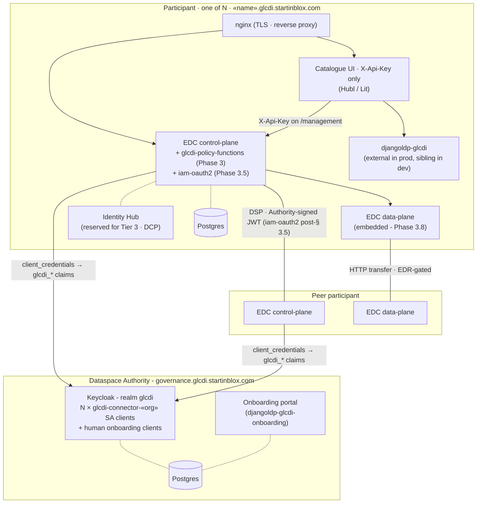

# GLCDI Policy Support - Implementation Plan

This document is the **index** for the GLCDI implementation plan. The phase-by-phase content has been split into individual files under [`plan/`](plan/) so each phase is reviewable in isolation; this index carries the strategic front matter (TL;DR, identity tiering, runtime architecture) plus the cross-cutting appendices (dependency graph, relation to project phases). Every phase in the table below links to its own file.

## TL;DR

GLCDI's path from today's single open-research policy to a fully enforced ODRL policy stack runs through eight phases plus a milestone gate, **with identity rolled out in tiers**: ship M1 on Tier 1 (the simplest viable shape), add Tier 2 if the MVP needs per-user accountability, and migrate to Tier 3 when decentralised identity becomes a priority.

**Identity tiering** (see [§ Identity Tiering Strategy](#identity-tiering-strategy) for the full picture):

- **Tier 1 (M1, this plan's default):** Authority Keycloak + 3 connector service accounts (one per org, `client_credentials` flow). UI authenticates to the local connector with `X-Api-Key` only - **no end-user OIDC anywhere**. Trust boundary is per-org; auditing is at org granularity.
- **Tier 2 (optional MVP improvement, post-M1):** add per-user OIDC at the UI layer, federated through the Authority Keycloak. Per-user audit and role-gated UI views. No change to connector ↔ connector trust.
- **Tier 3 (long-term):** decentralised identity - connectors present Verifiable Presentations (DCP/IATP); claims come from issued VCs rather than a central Keycloak. Removes the central-IdP dependency.

**Delivery order:**

1. **Phase 1 - Vocabulary & Namespace.** Register `glcdi:` JSON-LD context; agree on participant-type, certification-status, purpose taxonomies. Foundational; blocks Phase 3.
2. **Phase 1.5 - Identity (Tier 1) + Authority cleanup.** Complete the governance→authority rename (per [`ops/authority-migration.md`](../ops/authority-migration.md)); remove per-participant Keycloak from the participant compose stack; provision 3 connector service-account clients in the Authority Keycloak (`glcdi-connector-<org>`) with `glcdi_*` claims; UI runs on `X-Api-Key` only. **No end-user OIDC at this tier.**
3. **Phase 1.6 - Packaged organization onboarding (current intermediate delivery).** Replace the placeholder onboarding stack in `governance-services` with the `djangoldp_glcdi_onboarding` package - a public registration form at `/registration/` and a Django admin dashboard at `/registration/admin/`. Approval triggers automatic Keycloak provisioning (group, user with temp password, roles); approve/deny links land directly in admin mail. Pairs with the realm-roles cleanup (only `glcdi_member`, `glcdi_producer`, `glcdi_researcher`, `glcdi_non_profit`, `glcdi_non_regulatory`), the realm-wide spelling normalisation to `glcdi_organization`, and the addition of `realm-management.realm-admin` to the `governance` client's service account. **Connector onboarding stays out-of-band (Tier-1 - see § 2.7); only human-org onboarding is packaged here.**
4. **Phase 2 - Keycloak claims (on connector SAs).** Realm roles, attributes, protocol mappers so each connector's `client_credentials` token carries `glcdi_membership`, `glcdi_roles`, `glcdi_certification_status`, `glcdi_contribution_status`. Claims live on the SA users that back each connector client.
4. **Phase 3 - EDC policy functions.** Custom `AtomicConstraintFunction`s reading the claims above. ~200 LOC. § 3.5 swaps `iam-mock` for `iam-oauth2` against the Authority KC - **the gate to "real auth" between connectors**.
5. **Phase 4 - Seeding scripts.** Replace the current single `glcdi:policy:open-research` with per-asset access + contract policies - scoped initially to the M1 scenario.
6. **Phase 4.5 - Bruno test suite + Participant-UI configuration (parallel tracks).** (E) Bruno collection executing the M1 scenario non-interactively against the management API; (F) ship `participant-ui` in API-key-only mode for the asset/policy/contract/history components. Both run in parallel agents and feed Phase 5.
7. **Phase 5 - Integration testing.** Anchored on the M1 scenario: regenerative-producers-only access policy + internal-use-only contract policy, full positive and negative paths.
8. 🚦 **Milestone M1 - Regenerative-only access + internal-use-only contract, end-to-end demonstrable on Tier 1.** Gate before payment work starts.
9. **Phase 6 - Governance-level enforcement (proposal).** DSA clause wording, audit mechanism, consent-revocation procedure. Runs in parallel with the technical phases; ratification by the Dataspace Authority (see [`strategy/authority.md`](../strategy/authority.md)).
10. **Phase 7.1 - Payment-required workflow.** v0/v1/v2 substages per [`design/payment-gating.md`](../design/payment-gating.md). **Starts after M1 is signed off** - not before.
11. **Phase 7.2 - Identity (Tier 2): add user OIDC at the UI.** Optional MVP improvement: federated SSO via Authority KC, per-user audit, role-gated UI views. Schedulable in parallel with 7.1 once M1 ships.
12. **Phase 7.3 - Identity (Tier 3): decentralised claims via VC/DCP.** Long-term migration to Verifiable Credentials and the Decentralised Claims Protocol. Aligns GLCDI with Gaia-X / DSBA direction.
13. **Phase 7.4–7.5 - Other future enhancements.** Federated Catalogue policy metadata, participant-facing policy UI.

**Status (in-repo):** Phase 1 (vocabulary), Phase 1.5 (Tier-1 identity + rename), Phase 1.6 (packaged organization onboarding - **current intermediate delivery, local smoke complete (form → admin mail → approve → KC group `sib` with `glcdi_organization=["sib"]` + `glcdi_member+glcdi_producer` + new user + temp password mail); awaiting staging cutover**), Phase 2 (Keycloak claims on connector SAs), and Phase 4.5 (Bruno + UI tracks) have substantive in-repo work in their working trees, blocked only on the staging cutover (Path-A re-import per [`ops/deployment.md` § 2.2](../ops/deployment.md)). Phase 3 (EDC policy extension), Phase 4 (seeding scripts), Phase 5 (integration testing), and Milestone M1 are still to start. Phase 6 (governance / Trust Framework) runs in parallel and is owned outside this repo. Phase 7 (post-M1) - Tier 2 identity (7.2) and the VC migration (7.3) sit alongside payment (7.1) as candidate next workstreams once M1 is signed off.

**Parallelisation:** up to **3 concurrent agents** at peak - main implementation track (1.5 → 2 → 3 → 4 → 5 → M1 → 7.1), Bruno track (4.5 E), Participant-UI track (4.5 F). Phase 6 also runs in parallel with the technical phases.

**Dependency highlights:** Phase 1.5 (Tier-1 identity) blocks Phase 2 (claims now live on connector SAs in the Authority KC). Phase 3 depends on Phase 1's vocabulary. Phase 4 depends on Phases 2–3. Phase 4.5's two parallel tracks feed Phase 5. M1 gates payment. **Tier 2 (Phase 7.2) does not block M1** - it sits as an optional enhancement after the Tier-1 path ships. For cohort-by-cohort sequencing of *which* policies land *when*, see [`reference/policies/plan.md`](../reference/policies/plan.md).

---

---

## Identity Tiering Strategy

The GLCDI prototype is sequenced so that the **simplest credible identity model ships first** - letting the policy/contract/transfer machinery prove itself end-to-end on Tier 1 - and richer identity is layered on only as the dataspace's governance and audit needs justify it. The three tiers are mutually compatible: each adds capability on top of the previous one without invalidating the work already shipped.

| Tier | Phase | What it covers | What it doesn't cover |
|------|-------|----------------|-----------------------|
| **Tier 1** - single-tier, connector-only | **Phase 1.5** (M1 default) | One Authority Keycloak. One `client_credentials` client + service account per participant connector (`glcdi-connector-<org>`), carrying `glcdi_*` claims. Connector ↔ connector trust via Authority-KC-signed JWTs (`iam-oauth2` post-§ 3.5). UI authenticates to the *local* connector with `X-Api-Key` only - **no end-user OIDC anywhere**. | Per-user identity in the UI; per-user audit ("which operator at caney-fork pressed negotiate?"); decentralised credential issuance. |
| **Tier 2** - add user OIDC at the UI | **Phase 7.2** (optional, post-M1) | Adds per-user OIDC at the UI layer, federated through the Authority KC (single realm, single `glcdi-ui` client). Per-user roles + audit; oauth2-proxy in front of `/management` validates user JWTs in addition to `X-Api-Key`. Connector ↔ connector trust unchanged from Tier 1. | Decentralised credential issuance; cross-dataspace identity portability. |
| **Tier 3** - decentralised claims via VC/DCP | **Phase 7.3** (long-term) | Connectors present Verifiable Presentations (W3C VCs, signed by issuers) instead of Authority-KC-issued JWTs. Identity Hub holds VCs; the Decentralised Claims Protocol (DCP / IATP) handles issuance and verification. Aligns GLCDI with Gaia-X / DSBA. | - |

### Why Tier 1 first

1. **Smallest surface to validate by M1.** The M1 scenario tests policy/contract/transfer behaviour, not authentication. Shipping Tier 1 means M1's pass/fail signal is about the policy stack, not about whether OIDC iframe redirects worked.
2. **Org-level claims are sufficient for the policies in scope.** Every M1-relevant claim (`glcdi_membership`, `glcdi_roles`, `glcdi_certification_status`) is an organisation property, not a per-user one. Putting them on per-org SAs is the natural shape.
3. **Tier 2 is a clean addition.** Adding user OIDC later doesn't reshape the policy stack - it adds a layer in front of `/management` and a session story for the UI. The connector trust path doesn't change.
4. **Avoids duplicating work that will be replaced anyway.** Tier 3 (VC/DCP) eventually replaces the Authority KC as the *issuer* of connector credentials. Investing heavily in Tier-2 user OIDC scaffolding (per-participant brokering, IdP federation mappers) before M1 is investing in something Tier 3 will obsolete.

### When to graduate

- **From Tier 1 to Tier 2:** when an MVP stakeholder asks "who at caney-fork did this?" and the audit log answer ("someone with the API key") is no longer acceptable; or when role-gated UI views (different views for `data-steward` vs. `researcher` inside one org) become a product requirement.
- **From Tier 2 to Tier 3:** when GLCDI joins a multi-dataspace federation, when the Authority KC becomes a single point of trust failure that the governance body wants to dilute, or when alignment with Gaia-X / DSBA federation requirements becomes mandatory.

---

---

## Runtime architecture (Tier 1 - M1 target)

The runtime the phases below build toward is a **one Authority + N participants** deployment. The Authority holds identity, realm roles, and onboarding. Each participant runs the same Compose stack; peers negotiate over DSP and fetch data over an EDR-gated data-plane. At Tier 1 there is exactly one credential at each edge: **`X-Api-Key` at the management-API edge, an Authority-signed JWT (minted via `client_credentials` on the connector's service-account client) at the DSP edge**. No user accounts in any Keycloak. No oauth2-proxy. No per-participant Keycloak.



### Which phase builds which piece

| Block | Delivered by |
|-------|--------------|
| Authority KC realm + `glcdi-connector-«org»` service-account clients | Phase 1.5.4 |
| Authority KC claim mappers on the SA users (`glcdi_membership`, `glcdi_roles`, `glcdi_certification_status`, `glcdi_contribution_status`) | Phase 2.1 – 2.4 |
| Onboarding portal (`djangoldp-glcdi-onboarding`) | Phase 1.6 |
| Removal of per-participant Keycloak + oauth2-proxy from the participant stack | Phase 1.5.2 |
| `X-Api-Key` as the primary management-API gate | Phase 1.5.3 |
| `glcdi-policy-functions` EDC extension | Phase 3.1 – 3.4 |
| Swap `iam-mock` → `iam-oauth2` (real DSP-edge auth) | Phase 3.5 - the load-bearing gate to "real auth" between connectors |
| Embedded data-plane + `HttpData` endpoint generator | Phase 3.8 |
| M1-scoped seeding scripts (regenerative-only access + internal-use-only contract) | Phase 4 |
| Bruno test suite exercising the M1 scenario via management API | Phase 4.5.E |
| Participant-UI in API-key-only mode for asset / policy / contract / history | Phase 4.5.F |
| End-to-end M1 demonstration | 🚦 Milestone M1 |

### What Tier 2 / Tier 3 change on this diagram

- **Tier 2 (Phase 7.2)** - add a single `glcdi-ui` OIDC client on the Authority realm, add oauth2-proxy back in front of `/management`, add per-user OIDC + role-gated views to the UI. Connector-to-connector trust is unchanged.
- **Tier 3 (Phase 7.3)** - the Authority KC stops being the connector-token issuer. Connectors present Verifiable Presentations minted by the Identity Hub via DCP / IATP; claims come from issued VCs rather than KC service accounts.

---

---

## Phases

| # | Phase | File |
|---|-------|------|
| 1 | GLCDI Vocabulary & Namespace | [`plan/phase-1-vocabulary.md`](plan/phase-1-vocabulary.md) |
| 1.5 | Identity (Tier 1) - Single-tier auth + Authority cleanup | [`plan/phase-1.5-identity-tier1.md`](plan/phase-1.5-identity-tier1.md) |
| 1.6 | Packaged Organization Onboarding - Current Intermediate Delivery | [`plan/phase-1.6-onboarding.md`](plan/phase-1.6-onboarding.md) |
| 2 | Keycloak Claims Configuration - Connector Service-Account Tokens | [`plan/phase-2-keycloak-claims.md`](plan/phase-2-keycloak-claims.md) |
| 3 | EDC Policy Extension Development | [`plan/phase-3-edc-policy-extension.md`](plan/phase-3-edc-policy-extension.md) |
| 4 | Update Seeding Scripts & Contract Definitions | [`plan/phase-4-seeding.md`](plan/phase-4-seeding.md) |
| 4.5 | Bruno Test Suite + Participant-UI Configuration (Parallel Tracks) | [`plan/phase-4.5-bruno-and-ui.md`](plan/phase-4.5-bruno-and-ui.md) |
| 4.6 | Decouple participant-ui from `@startinblox/solid-tems` | [`plan/phase-4.6-decouple-ui.md`](plan/phase-4.6-decouple-ui.md) |
| 5 | Testing & Validation | [`plan/phase-5-testing.md`](plan/phase-5-testing.md) |
| M-M1 | Regenerative-Only Access + Internal-Use-Only Contract - End-to-End on Tier 1 | [`plan/milestone-m1.md`](plan/milestone-m1.md) |
| 6 | Governance-Level Enforcement (Non-Technical) - Proposal | [`plan/phase-6-governance.md`](plan/phase-6-governance.md) |
| 7 | Future Enhancements (Post-Prototype) | [`plan/phase-7-future.md`](plan/phase-7-future.md) |

---

## Dependency Graph

```
Phase 1 (Vocabulary)
    │
    └──→ Phase 1.5 (Identity Tier 1 + Authority cleanup)
              │
              ├──→ Phase 2 (KC claims on connector SAs)
              │        │
              │        └──→ Phase 3 (EDC Policy Functions; § 3.5 = iam-oauth2 swap, the Tier-1 auth gate)
              │                    │
              │                    └──→ Phase 4 (Seeding Scripts)
              │                              │
              │                              ├──→ Phase 4.5 E (Bruno test suite) ─┐
              │                              │                                    │
              │                              └──→ Phase 5 (Integration Testing) ──┤
              │                                                                   │
              └──→ Phase 4.5 F (Participant UI - Tier-1 strip-down) ──────────────┤
                                                                                  │
                                                                  🚦 Milestone M1 ←┘  (ships on Tier 1)
                                                                                  │
                                            ┌─────────────────────────────────────┤
                                            │                                     │
                          Phase 7.1 (Payment, per design/payment-gating.md)               │
                                            │                                     │
                          Phase 7.2 (Identity Tier 2: add user OIDC at the UI) ────┤  (additive; no block)
                                            │                                     │
                          Phase 7.3 (Identity Tier 3: VC / DCP migration) ────────┤  (long-term)
                                            │                                     │
                          Phase 7.4–7.5 (Federated Catalogue, Policy UI) ─────────┘

Phase 6 (Governance / Legal) - runs in parallel with all technical phases,
                                aligned with Trust Framework v0→v1
```

**Concurrent agents at peak:** 3 (main implementation track, Bruno track 4.5.E, Participant-UI track 4.5.F).

**Tier sequencing:** Phases 7.1 / 7.2 / 7.3 are **independent** post-M1 candidates - they don't block each other. Stakeholders pick the order based on priority (revenue model? per-user audit? federation alignment?).

## Relation to Main Project Phases

| This plan's phase | Maps to main project phase |
|-------------------|----------------------------|
| Phase 1 + 1.5 | Between Phase 1 (done) and Phase 2 (infra) - can start now; 1.5 absorbs the in-flight authority rename and ships **Identity Tier 1** |
| Phase 2–3 | During Phase 2–3, before first deployment of the milestone scenario; § 3.5 is the Tier-1 auth gate |
| Phase 4 | Replaces the simple policies in Phase 5 (seeding) - narrowed to M1 scope (regenerative-only + internal-use-only) |
| Phase 4.5 (E + F) | Parallel agent tracks; UI & test infra for the M1 demo (UI ships in API-key-only mode at Tier 1) |
| Phase 5 | Extends Phase 5 (integration testing); anchored on the M1 scenario |
| Milestone M1 | Demo gate; ships on Tier 1; signed off before any Phase 7 workstream starts |
| Phase 6 | Parallel to all technical phases, aligned with Trust Framework v0→v1 |
| Phase 7.1 | Begins **after M1**; substages v0/v1/v2 per [`design/payment-gating.md`](../design/payment-gating.md) |
| Phase 7.2 | **Identity Tier 2** - user OIDC at the UI; optional MVP improvement; non-blocking |
| Phase 7.3 | **Identity Tier 3** - VC / DCP migration; long-term, federation-aligned |
| Phase 7.4–7.5 | Federated Catalogue policy metadata; participant-facing Policy UI |

